# AMS Local: Complete End-to-End System & Module Data Flowchart

This document details the exact creation sequence, data relationships, and operational lifecycles across all 26 modules in **AMS Local (Apartment Management System)**.

---

## 1. Master End-to-End Flowchart Diagram

```mermaid
flowchart TD
    %% ==========================================
    %% STAGE 1: PHYSICAL INFRASTRUCTURE
    %% ==========================================
    subgraph S1["STAGE 1: Physical Infrastructure Setup"]
        direction TB
        COMM["1. Community Profile<br/><b>communities</b><br/>• Name, Address, Contact, PIN"]
        BLDG["2. Buildings / Towers<br/><b>buildings</b><br/>• Name, Total Floors, Total Units"]
        FLR["3. Floors / Levels<br/><b>floors</b><br/>• Floor #, Custom Name (G, 1, 2, B1)"]
        APT["4. Apartments / Units / Rooms<br/><b>apartments</b><br/>• Number (101), Type (2BHK), Area (sqft)<br/>• Status (Vacant / Occupied / Rented)"]
        PRK["5. Parking Slots<br/><b>parking_slots</b><br/>• Slot # (P-01), Type (Car / Bike)"]

        COMM -->|"1:N (community_id)"| BLDG
        BLDG -->|"1:N (building_id) Auto-generated"| FLR
        BLDG -->|"1:N (building_id)"| APT
        FLR -->|"1:N (floor_id)"| APT
        APT -->|"1:1 Optional (apartment_id)"| PRK
    end

    %% ==========================================
    %% STAGE 2: CUSTOMER / RESIDENT ONBOARDING
    %% ==========================================
    subgraph S2["STAGE 2: Resident / Customer Onboarding"]
        direction TB
        RES["6. Residents / Customers<br/><b>residents</b><br/>• Name, Phone, Email, Move-in Date<br/>• Role: Owner / Tenant"]
        FAM["7. Family / Dependents<br/><b>family_members</b><br/>• Name, Relation, Age"]
        VEH["8. Registered Vehicles<br/><b>vehicles</b><br/>• Plate #, Vehicle Type, Model"]

        APT -->|"1:N (apartment_id)<br/>Changes status to Occupied"| RES
        RES -->|"1:N (resident_id)"| FAM
        RES -->|"1:N (resident_id)"| VEH
        VEH -.->|"Authorized to park in"| PRK
    end

    %% ==========================================
    %% STAGE 3: AMENITIES, BOOKINGS & GATE ACCESS
    %% ==========================================
    subgraph S3["STAGE 3: Amenities, Bookings & Daily Gate Flow"]
        direction TB
        AMEN["9. Amenities Catalog<br/><b>amenities</b><br/>• Clubhouse, Pool, Gym, Tennis Court<br/>• Capacity & Slot Limits"]
        BOOK["10. Facility Bookings<br/><b>facility_bookings</b><br/>• Date, Time Slot, Status (Booked)"]
        VIS["11. Front Gate Visitors<br/><b>visitors</b><br/>• Guest Name, Phone, Purpose, Vehicle #"]
        PASS["12. Gate Passes<br/><b>visitor_passes</b><br/>• Verification Code, Validity Window"]
        STAFF["13. Staff Registry<br/><b>staff</b><br/>• Security, Cleaners, Guards, Salary"]
        ATT["14. Daily Attendance<br/><b>staff_attendance</b><br/>• Date, Shift, Present / Absent"]

        AMEN -->|"1:N (amenity_id)"| BOOK
        APT -->|"1:N (apartment_id)<br/>Resident books amenity"| BOOK

        APT -->|"1:N (apartment_id)<br/>Visit destination flat"| VIS
        VIS -->|"1:1 (visitor_id)<br/>Entry authorization"| PASS
        STAFF -->|"1:N (staff_id)<br/>Daily clock-in"| ATT
    end

    %% ==========================================
    %% STAGE 4: MAINTENANCE BILLING & PAYMENTS
    %% ==========================================
    subgraph S4["STAGE 4: Maintenance Billing & Payment Cycle"]
        direction TB
        MCAT["15. Billing Categories<br/><b>maintenance_categories</b><br/>• Base Water, DG Power, Sinking Fund"]
        MBILL["16. Monthly Maintenance Bills<br/><b>maintenance_bills</b><br/>• Month, Year, Due Date, Total Amount<br/>• Status (Unpaid / Paid / Overdue)"]
        BITEM["17. Line Item Breakdown<br/><b>bill_items</b><br/>• Item Description, Charge Amount"]
        PAY["18. Payment Receipts<br/><b>payments</b><br/>• Settled Amount, Date, Mode (UPI/Cash)<br/>• Transaction Reference"]

        MCAT -.->|"Configures charge types"| BITEM
        APT -->|"1:N (apartment_id)<br/>Monthly billing cycle"| MBILL
        MBILL -->|"1:N (bill_id) Itemized details"| BITEM
        MBILL -->|"1:N (bill_id)<br/>Settles invoice to PAID"| PAY
    end

    %% ==========================================
    %% STAGE 5: OPEX, EXPENSES & VENDORS
    %% ==========================================
    subgraph S5["STAGE 5: OPEX, Vendors & Procurement"]
        direction TB
        VEND["19. Vendors & Contractors<br/><b>vendors</b><br/>• Plumbing, Lift AMC, Electrician, Pest"]
        ECAT["20. Expense Categories<br/><b>expense_categories</b><br/>• Utilities, Repairs, Fuel, Wages"]
        EXP["21. Society Expenses<br/><b>expenses</b><br/>• Amount, Description, Invoice Date"]
        VPAY["22. Vendor Payouts<br/><b>vendor_payments</b><br/>• Disbursed Amount, Date, Voucher"]

        VEND -->|"1:N (vendor_id)"| EXP
        ECAT -->|"1:N (category_id)"| EXP
        VEND -->|"1:N (vendor_id)"| VPAY
    end

    %% ==========================================
    %% STAGE 6: GOVERNANCE, ASSETS & HELPDESK
    %% ==========================================
    subgraph S6["STAGE 6: Governance, Helpdesk & Asset Care"]
        direction TB
        ASSET["23. Physical Assets<br/><b>assets</b><br/>• STP Plant, DG Genset, Lifts, Pumps"]
        AMAINT["24. Asset Service Logs<br/><b>asset_maintenance</b><br/>• Service Date, Cost, Technician"]
        COMP["25. Complaints & Tickets<br/><b>complaints</b><br/>• Water Leak, Noise, Priority, Status"]
        COMMNT["26. Ticket Comments<br/><b>complaint_comments</b><br/>• Action Taken, Resolution Note"]
        NOTIC["27. Digital Notices<br/><b>notices</b><br/>• Broadcast Title, Circular Content, Priority"]
        EVT["28. Community Events<br/><b>events</b><br/>• Festival, AGM Meeting, Sports Day"]
        DOC["29. Document Vault<br/><b>documents</b><br/>• Society Bylaws, Deeds, NOCs, Audits"]

        ASSET -->|"1:N (asset_id)"| AMAINT
        APT -->|"1:N (apartment_id)<br/>Reported by unit"| COMP
        COMP -->|"1:N (complaint_id)"| COMMNT
        COMM -.->|"Broadcasts to all residents"| NOTIC
        COMM -.->|"Engages community in"| EVT
    end

    %% ==========================================
    %% STAGE 7: AUDIT, TELEMETRY & REPORTING
    %% ==========================================
    subgraph S7["STAGE 7: Executive Telemetry & Offline Snapshots"]
        direction TB
        AUDIT["30. Audit Trail<br/><b>audit_logs</b><br/>• User Action, Timestamp, Entity ID"]
        REPS["31. Financial & Operational Reports<br/><b>Analytics Engine</b><br/>• Recovery %, Cashflow, OPEX Breakdown"]
        BACKUP["32. SQLite Local Vault<br/><b>Encrypted .db File</b><br/>• Zero Cloud Dependency, Offline Sync"]

        PAY -.->|"Collections Inflow"| REPS
        EXP -.->|"Expense Outflow"| REPS
        VPAY -.->|"Contractor Outflow"| REPS
        S1 -.->|"Structural telemetry"| AUDIT
        S2 -.->|"Resident changes"| AUDIT
        S4 -.->|"Financial entries"| AUDIT
        REPS -->|"Complete snapshot export"| BACKUP
    end

    %% Key Process Connections Across Subgraphs
    S1 ==>|"Units ready for occupancy"| S2
    S2 ==>|"Residents access facilities"| S3
    S2 ==>|"Invoices issued to occupied units"| S4
    S4 ==>|"Surplus reserves fund maintenance & vendors"| S5
    S5 -.->|"Vendor technicians service equipment"| S6
    S4 & S5 ==>|"Consolidated financial telemetry"| S7

    %% Styling
    classDef infra fill:#e0f2fe,stroke:#0284c7,stroke-width:2px,color:#0f172a;
    classDef resident fill:#dcfce7,stroke:#16a34a,stroke-width:2px,color:#0f172a;
    classDef gate fill:#fef3c7,stroke:#d97706,stroke-width:2px,color:#0f172a;
    classDef finance fill:#fee2e2,stroke:#dc2626,stroke-width:2px,color:#0f172a;
    classDef opex fill:#f3e8ff,stroke:#9333ea,stroke-width:2px,color:#0f172a;
    classDef govern fill:#ffedd5,stroke:#ea580c,stroke-width:2px,color:#0f172a;
    classDef audit fill:#f1f5f9,stroke:#475569,stroke-width:2px,color:#0f172a;

    class COMM,BLDG,FLR,APT,PRK infra;
    class RES,FAM,VEH resident;
    class AMEN,BOOK,VIS,PASS,STAFF,ATT gate;
    class MCAT,MBILL,BITEM,PAY finance;
    class VEND,ECAT,EXP,VPAY opex;
    class ASSET,AMAINT,COMP,COMMNT,NOTIC,EVT,DOC govern;
    class AUDIT,REPS,BACKUP audit;
```

---

## 2. Comprehensive Module Matrix: What Each Module Means & What is Inside It

Below is the complete reference table detailing **what each module means in real-world society management**, **the exact data fields stored inside it**, **why it is required**, and **how it connects to other modules**:

| Step | Module & Table | What It Means (Real-World Concept) | What is Inside It (Data Fields & Attributes) | Why It's Needed & How It Connects |
|:---:|:---|:---|:---|:---|
| **1** | **Community** `communities` | **The Root Legal Society Profile**. Represents the entire gated residential complex or co-operative housing society (e.g., *"Sunrise Heights Co-operative Housing Society"*). | • `id` *(Primary Key)* • `name` *(Official registered name)* • `address`, `city`, `state`, `pincode` • `contact_number`, `email` • `created_at` *(Timestamp)* | **The foundation of everything**. Acts as the master parent for all towers. Its address and contact info appear on all printed invoices, receipts, and circulars. |
| **2** | **Buildings / Towers** `buildings` | **The Physical Residential Towers / Blocks**. Represents individual architectural towers or wings inside the society (e.g., *"Tower A"*, *"Tower B"*, *"East Wing"*). | • `id` *(Primary Key)* • `community_id` *(Links to Community)* • `name` *(e.g. Tower A)* • `total_floors` *(e.g. 5 floors)* • `total_apartments` *(e.g. 20 flats)* • `created_at` *(Timestamp)* | **Organizes vertical infrastructure**. Setting `total_floors` automatically triggers floor generation. Holds the apartments belonging to this tower. |
| **3** | **Floors** `floors` | **The Vertical Levels / Tiers**. Represents the specific level inside a building (e.g., *Ground Floor*, *Floor 1*, *Floor 2*, *Basement -1*). | • `id` *(Primary Key)* • `building_id` *(Links to Building)* • `floor_number` *(Integer: -1, 0, 1, 2...)* • `name` *(Custom label, e.g. "Ground Floor", "Mezzanine")* | **Crucial for apartment addressing**. Ensures apartments are placed on the right level. Shows up in dropdowns as *"Tower A - Floor 1"*. |
| **4** | **Apartments / Units** `apartments` | **Individual Flats / Homes / Doors**. The actual living units where families reside (e.g., *Flat 101*, *Flat A-204*, *Penthouse 1*). | • `id` *(Primary Key)* • `building_id` *(Links to Building)* • `floor_id` *(Links to Floor)* • `apartment_number` *(e.g. "A-204")* • `type` *(1BHK, 2BHK, 3BHK, Studio, Penthouse)* • `area_sqft` *(e.g. 1250 sq.ft)* • `status` *('vacant', 'occupied', 'rented')* | **The central anchor of the whole system**. Everything links to the apartment: Residents live here, Parking slots are assigned here, Maintenance bills are issued here, and Visitors arrive here. |
| **5** | **Parking Slots** `parking_slots` | **Vehicle Parking Bays**. Designated car or two-wheeler parking spots in stilt, basement, or open areas (e.g., *P-12*, *B1-04*). | • `id` *(Primary Key)* • `apartment_id` *(Optional link to assigned flat)* • `slot_number` *(e.g. "P-14")* • `type` *(Covered 4-Wheeler, Open 2-Wheeler)* | **Prevents parking disputes**. Links an allotted bay to an apartment. Validates that a resident's registered vehicle parks in the correct spot. |
| **6** | **Residents / Customers** `residents` | **The Primary Occupants / Customers**. The head of the house—either the property owner or the registered tenant. | • `id` *(Primary Key)* • `apartment_id` *(Links to Apartment)* • `name` *(e.g. "John Doe")* • `phone`, `email` • `type` *('owner' or 'tenant')* • `move_in_date` *(Date)* | **Turns a vacant flat into an active home**. Flips apartment status to 'occupied'. The resident receives maintenance bills, books amenities, and authorizes gate visitors. |
| **7** | **Family Members** `family_members` | **Dependents & Relatives**. Family members living in the apartment (e.g., spouse, children, parents). | • `id` *(Primary Key)* • `resident_id` *(Links to Resident)* • `name` *(e.g. "Jane Doe")* • `relation` *(Spouse, Child, Parent)* • `age` *(Integer)* | **Ensures gate security & headcounts**. Used by security guards to verify family members entering the campus without needing a visitor pass. |
| **8** | **Vehicles** `vehicles` | **Resident Vehicles**. Registered four-wheelers and two-wheelers belonging to society residents. | • `id` *(Primary Key)* • `resident_id` *(Links to Resident)* • `vehicle_number` *(Plate: "KA-03-MG-4122")* • `type` *(Car, Motorcycle, Scooter)* • `model` *(e.g. "Honda City White")* | **Automated gate entry & security**. Recognized at the security booth. Validates authorized campus entry against allocated parking slots. |
| **9** | **Amenities / Facilities** `amenities` | **Shared Society Facilities Catalog**. Recreational and common facilities provided for community use. | • `id` *(Primary Key)* • `name` *(e.g. "Clubhouse Hall", "Gym", "Pool")* • `description` *(Rules, timings)* • `capacity` *(Max persons, e.g. 100)* | **Master facility directory**. Defines which facilities exist so residents can reserve time slots. |
| **10** | **Facility Bookings** `facility_bookings` | **Time-Slotted Reservations**. Bookings made by residents to reserve a facility for a party, meeting, or game. | • `id` *(Primary Key)* • `amenity_id` *(Links to Amenity)* • `apartment_id` *(Links to Flat/Resident)* • `date`, `start_time`, `end_time` • `status` *('booked', 'cancelled', 'completed')* | **Prevents booking clashes**. Manages the community calendar. Can trigger amenity rental surcharges on the resident's monthly bill. |
| **11** | **Front Gate Visitors** `visitors` | **External Guests, Deliveries & Cabs**. Logs every non-resident person entering through the security gate booth. | • `id` *(Primary Key)* • `apartment_id` *(Target flat being visited)* • `name` *(Guest name)*, `phone` • `purpose` *(Guest, Amazon Delivery, Uber, Plumber)* • `entry_time`, `exit_time` | **The security shield of the society**. Allows guards to record who entered, which flat they visited, and when they left. |
| **12** | **Visitor Passes** `visitor_passes` | **Digital Entry Pass / Clearance OTP**. Pre-authorized gate passes generated for expected guests or delivery couriers. | • `id` *(Primary Key)* • `visitor_id` *(Links to Visitor)* • `code` *(6-digit numeric pass code or OTP)* • `valid_from`, `valid_to` *(Validity window)* | **Fast, friction-free gate clearance**. The visitor shows the code or QR at the security gate to enter without phone delays. |
| **13** | **Staff Roster** `staff` | **Society Employees Registry**. Personnel hired for daily operations (security guards, sweepers, gardeners, managers). | • `id` *(Primary Key)* • `name` *(e.g. "Ramesh Kumar")* • `role` *(Security Guard, Housekeeper, Electrician)* • `phone` • `salary` *(Monthly wage)*, `join_date` | **Human resource management**. Tracks who works for the society and determines monthly payroll liabilities. |
| **14** | **Staff Attendance** `staff_attendance` | **Daily Shift & Clock-In Logs**. Day-to-day attendance tracking for all society staff members. | • `id` *(Primary Key)* • `staff_id` *(Links to Staff)* • `date` *(YYYY-MM-DD)* • `status` *('present', 'absent', 'half_day', 'on_leave')* | **Payroll accuracy**. Calculates net working days at month-end to generate staff wage expenses. |
| **15** | **Billing Categories** `maintenance_categories` | **Master Types of Maintenance Dues**. Configures standard billing heads used across invoices. | • `id` *(Primary Key)* • `name` *(e.g. "Water Charges", "Base Maintenance", "DG Backup", "Sinking Fund")* | **Defines invoice line-item structure**. Allows the society to charge transparent, categorized line items on invoices. |
| **16** | **Maintenance Bills** `maintenance_bills` | **Monthly Society Invoices**. The official invoice issued to each flat every billing cycle for shared maintenance costs. | • `id` *(Primary Key)* • `apartment_id` *(Links to Flat)* • `month` *(1..12)*, `year` *(e.g. 2026)* • `amount` *(Total payable, e.g. Rs. 3,100)* • `due_date` *(Payment deadline)* • `status` *('unpaid', 'paid', 'overdue')* | **The core financial revenue engine**. Tracks who owes what. Drives society collection progress, defaulter lists, and pending dues telemetry. |
| **17** | **Bill Line Items** `bill_items` | **Itemized Charge Breakdown**. The individual transparent items that sum up to the total bill amount. | • `id` *(Primary Key)* • `bill_id` *(Links to Maintenance Bill)* • `description` *(e.g. "Base Maintenance", "Clubhouse Surcharge", "Late Fine")* • `amount` *(e.g. Rs. 2,500, Rs. 400, Rs. 200)* | **Transparency for residents**. Shows residents exactly what they are paying for on printable PDF invoices and receipts. |
| **18** | **Payments & Receipts** `payments` | **Settlement Receipts**. Recorded whenever a resident pays their maintenance invoice. | • `id` *(Primary Key)* • `bill_id` *(Links to Maintenance Bill)* • `amount` *(Amount paid, e.g. Rs. 3,100)* • `payment_date` *(Date)* • `mode` *(UPI, Cash, Cheque, Bank Transfer)* • `reference` *(Transaction ID / Cheque #)* | **Settles debts and funds society reserves**. Flips bill status to 'paid', drops pending dues to Rs. 0, and increases society cash balance. |
| **19** | **Vendors & Contractors** `vendors` | **Contractors & Service Providers**. Third-party agencies engaged for society maintenance contracts and repairs. | • `id` *(Primary Key)* • `name` *(e.g. "Otis Elevator Co.", "CleanPro Pest")* • `category` *(Plumbing, Electrical, Lifts, STP, Landscaping)* • `phone`, `email` | **Supplier & contractor directory**. Linked to service contracts, helpdesk ticket dispatches, and vendor payout vouchers. |
| **20** | **Expense Categories** `expense_categories` | **OPEX Accounting Classification**. Standard accounting heads to track where society funds are spent. | • `id` *(Primary Key)* • `name` *(e.g. "Utilities", "Repairs", "Salaries", "Diesel", "Housekeeping")* | **Financial categorization**. Used to generate category-wise expense donut charts and annual audit reports. |
| **21** | **Society Expenses** `expenses` | **Operational Outflow Records (OPEX)**. Every disbursement paid out from society funds to keep the campus running. | • `id` *(Primary Key)* • `category_id` *(Links to Expense Category)* • `vendor_id` *(Optional link to Vendor)* • `description` *(e.g. "Diesel for DG Generator - 200 Litres")* • `amount` *(e.g. Rs. 18,500)* • `date` *(Date)* | **Tracks society cash outflow**. Subtracted from collections inflow to compute the Net Reserve surplus/deficit. |
| **22** | **Vendor Payouts** `vendor_payments` | **Contractor Payment Vouchers**. Formal payment records disbursed to external vendors for services rendered. | • `id` *(Primary Key)* • `vendor_id` *(Links to Vendor)* • `amount` *(e.g. Rs. 12,000)* • `date` *(Date)* • `description` *(e.g. "Q3 Lift AMC Maintenance Settlement")* | **Vendor ledger management**. Ensures external agencies are paid accurately and prevents duplicate billing. |
| **23** | **Physical Assets** `assets` | **Capital Machinery & Equipment**. Valuable machinery, plant equipment, and infrastructure owned by the society. | • `id` *(Primary Key)* • `name` *(e.g. "Cummins 125 kVA Diesel Generator", "Kirloskar Water Pump #2", "Schindler Passenger Lift")* • `category` *(Power, Water, Elevator, Security)* • `purchase_date`, `value` *(Valuation)* • `location` *(e.g. "Basement Utility Room")* | **Asset management & depreciation**. Maintains equipment inventory and ensures critical infrastructure receives scheduled maintenance. |
| **24** | **Asset Maintenance** `asset_maintenance` | **Preventative Service & Repair Logs**. History of routine service, oil changes, filter renewals, or emergency repairs on assets. | • `id` *(Primary Key)* • `asset_id` *(Links to Asset)* • `date` *(Service date)* • `description` *(e.g. "Engine oil changed, air filters replaced")* • `cost` *(e.g. Rs. 4,200)* | **Prevents equipment breakdowns**. Maintains machinery warranty logs and feeds maintenance costs into the expense ledger. |
| **25** | **Complaints / Helpdesk** `complaints` | **Resident Service Requests & Grievances**. Tickets reported by residents regarding apartment issues or campus malfunctions. | • `id` *(Primary Key)* • `apartment_id` *(Links to Flat reporting issue)* • `title` *(e.g. "Water leakage in kitchen pipe")* • `description` • `priority` *('low', 'normal', 'urgent')* • `status` *('open', 'in_progress', 'resolved')* | **Resident satisfaction & ticket resolution**. Alerts the manager, dispatches a plumber/electrician, and tracks resolution speed. |
| **26** | **Complaint Comments** `complaint_comments` | **Ticket Progress Logs & Action Notes**. Activity logs recorded by technicians or managers while resolving a complaint. | • `id` *(Primary Key)* • `complaint_id` *(Links to Complaint)* • `comment` *(e.g. "Replaced washer and inlet pipe valve. Leak stopped.")* • `date` *(Timestamp)* | **Accountability and resolution audit**. Provides a transparent history of repairs before marking the complaint 'resolved'. |
| **27** | **Digital Notices** `notices` | **Broadcast Circulars & Announcements**. Official bulletins published by the managing committee for all society members. | • `id` *(Primary Key)* • `title` *(e.g. "Water Supply Shutdown on Wednesday")* • `content` *(Detailed instructions)* • `date` *(Broadcast date)* • `priority` *('normal', 'urgent')* | **Community communication**. Displayed instantly on the digital notice board and mobile app dashboard. |
| **28** | **Community Events** `events` | **Social, Cultural & AGM Meetings**. Festivals, sports days, celebrations, or formal Annual General Body meetings. | • `id` *(Primary Key)* • `name` *(e.g. "Diwali Cultural Night", "Annual General Meeting 2026")* • `description` • `date`, `venue` *(e.g. "Clubhouse Amphitheater")* | **Community engagement**. Helps coordinate society events and books relevant campus venues. |
| **29** | **Documents Vault** `documents` | **Legal, Municipal & Compliance Vault**. Repository of critical society deeds, sanction plans, bylaws, and certificates. | • `id` *(Primary Key)* • `title` *(e.g. "Society Registration Certificate", "Fire Safety NOC 2026", "Society Bylaws")* • `category` *(Legal, Compliance, Architectural, Financial)* • `file_path` *(Local device path)* • `upload_date` *(Timestamp)* | **Legal compliance & record preservation**. Keeps vital documents securely archived offline for immediate committee inspection. |
| **30** | **Audit Trail** `audit_logs` | **Security & Activity Tracking Log**. Automatic audit record of every administrative action taken in the app. | • `id` *(Primary Key)* • `action` *(e.g. "CREATE_BILL", "DELETE_RESIDENT", "RECORD_PAYMENT")* • `entity` *(Table name)*, `entity_id` • `user_id`, `timestamp` | **Zero-tamper accountability**. Provides a clear chronological trail of who changed what in the database. |
| **31** | **Analytics Engine** *(In-Memory Query Engine)* | **Financial & Operational Intelligence**. Real-time computational layer calculating society health indicators. | • Computes: Total Billed, Total Collected, Collection Recovery %, Pending Defaulters, OPEX Breakdown, Cashflow Trends, Net Reserve Balance. | **Executive decision making**. Powers the live KPI widgets, recovery progress bars, and OPEX donut charts. |
| **32** | **SQLite Local Vault** `apartment_mgmt.db` | **Encrypted On-Device Database File**. The master physical database file stored locally on the phone or tablet. | • Contains all 32 relational tables, indexes, constraints, and WAL journal. • Zero cloud dependence. 100% offline. | **Data sovereignty & privacy**. Guarantees that all resident data stays securely on your device, with one-tap backup & restore. |

---

## 3. End-to-End Operational Lifecycle Walkthrough

### Flow A: From Brick to Room (Infrastructure Setup)
$$\text{Community Profile} \longrightarrow \text{Building / Tower} \longrightarrow \text{Floors (1..N)} \longrightarrow \text{Apartments (Rooms)} \longrightarrow \text{Parking Slots}$$
1. **Community Profile**: Create the legal entity (e.g. *Sunrise Heights CHS*).
2. **Tower / Building**: Add *Tower A* with `total_floors: 5`.
3. **Floors Auto-Generation**: The system auto-generates *Floor 1*, *Floor 2*, *Floor 3*, *Floor 4*, and *Floor 5*. Custom floors (e.g. *Ground Floor*, *Basement*) can be renamed or added.
4. **Apartment / Room**: Under *Tower A* and *Floor 2*, create flat *A-204* (2BHK, 1,200 sqft, initial status: *Vacant*).
5. **Parking Allocation**: Create parking slot *P-14* (Covered Car) linked to apartment *A-204*.

### Flow B: Customer Onboarding & Living (Resident Lifecycle)
$$\text{Apartment A-204} \longrightarrow \text{Resident (Customer/Owner)} \longrightarrow \text{Family Members} \longrightarrow \text{Vehicles} \longrightarrow \text{Move-In Date}$$
1. **Resident Registration**: Onboard *John Doe* as *Owner* into flat *A-204*. The apartment status switches to **Occupied**.
2. **Family Dependents**: Add spouse and children linked to *John Doe*.
3. **Vehicle Registration**: Register car `KA-03-MG-4122` linked to *John Doe* and allocated to slot *P-14*.

### Flow C: Amenities Booking & Gate Operations
$$\text{Amenity (Clubhouse)} \longrightarrow \text{Resident Booking} \longrightarrow \text{Visitor Arrives} \longrightarrow \text{Gate Pass} \longrightarrow \text{Check-In} \longrightarrow \text{Stay} \longrightarrow \text{Exit}$$
1. **Amenity Catalog**: Admin registers *Clubhouse Party Hall* with capacity 100.
2. **Booking**: Resident of flat *A-204* books Clubhouse for an evening birthday slot.
3. **Guest Arrival**: Guest vehicle arrives at security gate. Security enters visitor name visiting unit *A-204*.
4. **Gate Pass & Check-In**: Instant security pass generated. Security checks in guest (**Check-In**).
5. **Stay & Exit**: After the event, security records exit timestamp (**Check-Out**).

### Flow D: Monthly Maintenance Billing & Payment Cycle
$$\text{Monthly Cycle} \longrightarrow \text{Bill Generated} \longrightarrow \text{Line Items Added} \longrightarrow \text{Invoice Sent} \longrightarrow \text{Payment Recorded} \longrightarrow \text{Receipt Issued}$$
1. **Billing Cycle Trigger**: On the 1st of the month, admin triggers the October cycle for all 48 units.
2. **Invoice Generation**: Invoice generated for *Flat A-204* for `Rs. 3,100` due in 15 days (Status: **Unpaid**).
3. **Itemized Line Items**:
   - Base Maintenance: `Rs. 2,500`
   - Clubhouse Surcharge: `Rs. 400`
   - Sinking Fund: `Rs. 200`
4. **Payment Settled**: Resident pays via UPI/Cash. Admin records payment with reference `UPI-982314`.
5. **Status Update**: Bill status immediately flips to **PAID**, outstanding receivables decrease, and telemetry updates live.

### Flow E: OPEX, Vendors & Helpdesk
$$\text{Complaint Logged} \longrightarrow \text{Staff / Vendor Dispatched} \longrightarrow \text{Work Resolved} \longrightarrow \text{Vendor Payout} \longrightarrow \text{Expense Recorded}$$
1. **Complaint Logged**: Resident of *A-204* reports *Water pipeline leakage in kitchen*.
2. **Vendor Dispatch**: Admin checks *Plumbing Vendor* and dispatches technician.
3. **Resolution**: Technician repairs leak. Admin adds work log comment and marks ticket **Resolved**.
4. **Vendor Payout & Expense**: Plumbing invoice paid (`Rs. 850`) and recorded under *Plumbing Repairs* expense category.
5. **Financial Telemetry**: Net Reserve = Collections minus OPEX updated on Reports dashboard.
