# AMS Local: Complete End-to-End System & Module Data Flowchart

This document details the exact creation sequence, data relationships, and operational lifecycles across all 26 modules in **AMS Local (Apartment Management System)**.

---

## 1. Master End-to-End Flowchart Diagram

```mermaid
flowchart TD
    %% ==========================================
    %% STAGE 1: PHYSICAL INFRASTRUCTURE
    %% ==========================================
    subgraph S1["STAGE 1: Physical Infrastructure Setup"]
        direction TB
        COMM["1. Community Profile<br/><b>communities</b><br/>• Name, Address, Contact, PIN"]
        BLDG["2. Buildings / Towers<br/><b>buildings</b><br/>• Name, Total Floors, Total Units"]
        FLR["3. Floors / Levels<br/><b>floors</b><br/>• Floor #, Custom Name (G, 1, 2, B1)"]
        APT["4. Apartments / Units / Rooms<br/><b>apartments</b><br/>• Number (101), Type (2BHK), Area (sqft)<br/>• Status (Vacant / Occupied / Rented)"]
        PRK["5. Parking Slots<br/><b>parking_slots</b><br/>• Slot # (P-01), Type (Car / Bike)"]

        COMM -->|"1:N (community_id)"| BLDG
        BLDG -->|"1:N (building_id) Auto-generated"| FLR
        BLDG -->|"1:N (building_id)"| APT
        FLR -->|"1:N (floor_id)"| APT
        APT -->|"1:1 Optional (apartment_id)"| PRK
    end

    %% ==========================================
    %% STAGE 2: CUSTOMER / RESIDENT ONBOARDING
    %% ==========================================
    subgraph S2["STAGE 2: Resident / Customer Onboarding"]
        direction TB
        RES["6. Residents / Customers<br/><b>residents</b><br/>• Name, Phone, Email, Move-in Date<br/>• Role: Owner / Tenant"]
        FAM["7. Family / Dependents<br/><b>family_members</b><br/>• Name, Relation, Age"]
        VEH["8. Registered Vehicles<br/><b>vehicles</b><br/>• Plate #, Vehicle Type, Model"]

        APT -->|"1:N (apartment_id)<br/>Changes status to Occupied"| RES
        RES -->|"1:N (resident_id)"| FAM
        RES -->|"1:N (resident_id)"| VEH
        VEH -.->|"Authorized to park in"| PRK
    end

    %% ==========================================
    %% STAGE 3: AMENITIES, BOOKINGS & GATE ACCESS
    %% ==========================================
    subgraph S3["STAGE 3: Amenities, Bookings & Daily Gate Flow"]
        direction TB
        AMEN["9. Amenities Catalog<br/><b>amenities</b><br/>• Clubhouse, Pool, Gym, Tennis Court<br/>• Capacity & Slot Limits"]
        BOOK["10. Facility Bookings<br/><b>facility_bookings</b><br/>• Date, Time Slot, Status (Booked)"]
        VIS["11. Front Gate Visitors<br/><b>visitors</b><br/>• Guest Name, Phone, Purpose, Vehicle #"]
        PASS["12. Gate Passes<br/><b>visitor_passes</b><br/>• Verification Code, Validity Window"]
        STAFF["13. Staff Registry<br/><b>staff</b><br/>• Security, Cleaners, Guards, Salary"]
        ATT["14. Daily Attendance<br/><b>staff_attendance</b><br/>• Date, Shift, Present / Absent"]

        AMEN -->|"1:N (amenity_id)"| BOOK
        APT -->|"1:N (apartment_id)<br/>Resident books amenity"| BOOK

        APT -->|"1:N (apartment_id)<br/>Visit destination flat"| VIS
        VIS -->|"1:1 (visitor_id)<br/>Entry authorization"| PASS
        STAFF -->|"1:N (staff_id)<br/>Daily clock-in"| ATT
    end

    %% ==========================================
    %% STAGE 4: MAINTENANCE BILLING & PAYMENTS
    %% ==========================================
    subgraph S4["STAGE 4: Maintenance Billing & Payment Cycle"]
        direction TB
        MCAT["15. Billing Categories<br/><b>maintenance_categories</b><br/>• Base Water, DG Power, Sinking Fund"]
        MBILL["16. Monthly Maintenance Bills<br/><b>maintenance_bills</b><br/>• Month, Year, Due Date, Total Amount<br/>• Status (Unpaid / Paid / Overdue)"]
        BITEM["17. Line Item Breakdown<br/><b>bill_items</b><br/>• Item Description, Charge Amount"]
        PAY["18. Payment Receipts<br/><b>payments</b><br/>• Settled Amount, Date, Mode (UPI/Cash)<br/>• Transaction Reference"]

        MCAT -.->|"Configures charge types"| BITEM
        APT -->|"1:N (apartment_id)<br/>Monthly billing cycle"| MBILL
        MBILL -->|"1:N (bill_id) Itemized details"| BITEM
        MBILL -->|"1:N (bill_id)<br/>Settles invoice to PAID"| PAY
    end

    %% ==========================================
    %% STAGE 5: OPEX, EXPENSES & VENDORS
    %% ==========================================
    subgraph S5["STAGE 5: OPEX, Vendors & Procurement"]
        direction TB
        VEND["19. Vendors & Contractors<br/><b>vendors</b><br/>• Plumbing, Lift AMC, Electrician, Pest"]
        ECAT["20. Expense Categories<br/><b>expense_categories</b><br/>• Utilities, Repairs, Fuel, Wages"]
        EXP["21. Society Expenses<br/><b>expenses</b><br/>• Amount, Description, Invoice Date"]
        VPAY["22. Vendor Payouts<br/><b>vendor_payments</b><br/>• Disbursed Amount, Date, Voucher"]

        VEND -->|"1:N (vendor_id)"| EXP
        ECAT -->|"1:N (category_id)"| EXP
        VEND -->|"1:N (vendor_id)"| VPAY
    end

    %% ==========================================
    %% STAGE 6: GOVERNANCE, ASSETS & HELPDESK
    %% ==========================================
    subgraph S6["STAGE 6: Governance, Helpdesk & Asset Care"]
        direction TB
        ASSET["23. Physical Assets<br/><b>assets</b><br/>• STP Plant, DG Genset, Lifts, Pumps"]
        AMAINT["24. Asset Service Logs<br/><b>asset_maintenance</b><br/>• Service Date, Cost, Technician"]
        COMP["25. Complaints & Tickets<br/><b>complaints</b><br/>• Water Leak, Noise, Priority, Status"]
        COMMNT["26. Ticket Comments<br/><b>complaint_comments</b><br/>• Action Taken, Resolution Note"]
        NOTIC["27. Digital Notices<br/><b>notices</b><br/>• Broadcast Title, Circular Content, Priority"]
        EVT["28. Community Events<br/><b>events</b><br/>• Festival, AGM Meeting, Sports Day"]
        DOC["29. Document Vault<br/><b>documents</b><br/>• Society Bylaws, Deeds, NOCs, Audits"]

        ASSET -->|"1:N (asset_id)"| AMAINT
        APT -->|"1:N (apartment_id)<br/>Reported by unit"| COMP
        COMP -->|"1:N (complaint_id)"| COMMNT
        COMM -.->|"Broadcasts to all residents"| NOTIC
        COMM -.->|"Engages community in"| EVT
    end

    %% ==========================================
    %% STAGE 7: AUDIT, TELEMETRY & REPORTING
    %% ==========================================
    subgraph S7["STAGE 7: Executive Telemetry & Offline Snapshots"]
        direction TB
        AUDIT["30. Audit Trail<br/><b>audit_logs</b><br/>• User Action, Timestamp, Entity ID"]
        REPS["31. Financial & Operational Reports<br/><b>Analytics Engine</b><br/>• Recovery %, Cashflow, OPEX Breakdown"]
        BACKUP["32. SQLite Local Vault<br/><b>Encrypted .db File</b><br/>• Zero Cloud Dependency, Offline Sync"]

        PAY -.->|"Collections Inflow"| REPS
        EXP -.->|"Expense Outflow"| REPS
        VPAY -.->|"Contractor Outflow"| REPS
        S1 -.->|"Structural telemetry"| AUDIT
        S2 -.->|"Resident changes"| AUDIT
        S4 -.->|"Financial entries"| AUDIT
        REPS -->|"Complete snapshot export"| BACKUP
    end

    %% Key Process Connections Across Subgraphs
    S1 ==>|"Units ready for occupancy"| S2
    S2 ==>|"Residents access facilities"| S3
    S2 ==>|"Invoices issued to occupied units"| S4
    S4 ==>|"Surplus reserves fund maintenance & vendors"| S5
    S5 -.->|"Vendor technicians service equipment"| S6
    S4 & S5 ==>|"Consolidated financial telemetry"| S7

    %% Styling
    classDef infra fill:#e0f2fe,stroke:#0284c7,stroke-width:2px,color:#0f172a;
    classDef resident fill:#dcfce7,stroke:#16a34a,stroke-width:2px,color:#0f172a;
    classDef gate fill:#fef3c7,stroke:#d97706,stroke-width:2px,color:#0f172a;
    classDef finance fill:#fee2e2,stroke:#dc2626,stroke-width:2px,color:#0f172a;
    classDef opex fill:#f3e8ff,stroke:#9333ea,stroke-width:2px,color:#0f172a;
    classDef govern fill:#ffedd5,stroke:#ea580c,stroke-width:2px,color:#0f172a;
    classDef audit fill:#f1f5f9,stroke:#475569,stroke-width:2px,color:#0f172a;

    class COMM,BLDG,FLR,APT,PRK infra;
    class RES,FAM,VEH resident;
    class AMEN,BOOK,VIS,PASS,STAFF,ATT gate;
    class MCAT,MBILL,BITEM,PAY finance;
    class VEND,ECAT,EXP,VPAY opex;
    class ASSET,AMAINT,COMP,COMMNT,NOTIC,EVT,DOC govern;
    class AUDIT,REPS,BACKUP audit;
```

---

## 2. Complete Step-by-Step Creation Sequence

To build and run an apartment society from scratch, follow this exact sequence:

| Step | Module | Table | Prerequisite | Output / Data Generated | Downstream Dependent Modules |
|:---|:---|:---|:---|:---|:---|
| **1** | **Community** | `communities` | None (Root entity) | Community ID, Address, Contact Info | Buildings, Notices, Events |
| **2** | **Buildings** | `buildings` | Community | Building ID, Name, Total Floors, Total Units | Floors, Apartments |
| **3** | **Floors** | `floors` | Building | Floor ID, Floor Number (0, 1, 2), Custom Label | Apartments (Room/Unit mapping) |
| **4** | **Apartments** | `apartments` | Building + Floor | Apartment ID, Flat Number, Sqft Area, Type (2BHK), Status | Residents, Parking, Bills, Bookings, Complaints, Visitors |
| **5** | **Parking Slots** | `parking_slots` | Optional Apartment | Slot ID, Slot Number (P-101), Vehicle Type | Vehicles / Resident Parking Allocation |
| **6** | **Residents** | `residents` | Apartment | Resident ID, Name, Phone, Email, Type (Owner/Tenant) | Family Members, Vehicles, Maintenance Bills, Facility Bookings |
| **7** | **Family Members** | `family_members` | Resident | Member ID, Relation, Age | Security Gate clearance |
| **8** | **Vehicles** | `vehicles` | Resident | Vehicle ID, License Plate, Make/Model, RFID Tag | Parking Slot usage, Security Gate auto-authorization |
| **9** | **Amenities** | `amenities` | None | Amenity ID, Name (Clubhouse, Gym, Pool), Capacity | Facility Bookings |
| **10** | **Facility Bookings** | `facility_bookings` | Amenity + Apartment | Booking ID, Date, Time Slot, Status (Booked) | Amenity Calendar Occupancy, Billing Surcharges |
| **11** | **Front Gate Visitors** | `visitors` | Apartment | Visitor ID, Guest Name, Purpose, Vehicle #, Entry/Exit | Security Gate Log, Resident Notification |
| **12** | **Visitor Passes** | `visitor_passes` | Visitor | Pass ID, Verification OTP / QR Code, Validity Window | Quick Entry Clearance at Security Gate |
| **13** | **Staff Roster** | `staff` | None | Staff ID, Role (Guard, Cleaner, Plumber), Phone, Wage | Staff Attendance, Payroll Expenses |
| **14** | **Staff Attendance** | `staff_attendance` | Staff | Attendance ID, Date, Present/Absent/Late Status | Monthly Salary Calculations |
| **15** | **Billing Categories** | `maintenance_categories` | None | Category ID, Name (Water, DG Power, Sinking Fund) | Itemized Bill Items |
| **16** | **Maintenance Bills** | `maintenance_bills` | Apartment | Bill ID, Month, Year, Due Date, Total Payable, Status (Unpaid) | Bill Items, Payments, Recovery Telemetry |
| **17** | **Bill Items** | `bill_items` | Maintenance Bill | Item ID, Line item description, Line item amount | Detailed Invoice PDF, Transparent Ledger |
| **18** | **Payments** | `payments` | Maintenance Bill | Payment ID, Settled Amount, Date, Mode (UPI/Cash), Ref # | Settled Bill (Status -> Paid), Cashflow Inflow |
| **19** | **Vendors** | `vendors` | None | Vendor ID, Agency Name, Category (Lift AMC, STP, Pest) | Vendor Payments, Society OPEX |
| **20** | **Expense Categories** | `expense_categories` | None | Category ID, Name (Utilities, Wages, Repairs) | Society Expenses |
| **21** | **Society Expenses** | `expenses` | Expense Category + Vendor | Expense ID, Amount, Voucher Date, Description | OPEX Accounting, Financial Cashflow Outflow |
| **22** | **Vendor Payouts** | `vendor_payments` | Vendor | Payout ID, Disbursed Amount, Voucher # | Vendor Account Ledger |
| **23** | **Physical Assets** | `assets` | None | Asset ID, Asset Name (Genset, Lifts, STP), Value | Asset Maintenance Logs |
| **24** | **Asset Maintenance** | `asset_maintenance` | Asset | Service ID, Service Date, Cost, Technician Remarks | Asset Longevity, Society Expense Ledger |
| **25** | **Complaints / Helpdesk**| `complaints` | Apartment | Ticket ID, Title, Description, Priority, Status (Open) | Complaint Comments, Vendor/Staff dispatch |
| **26** | **Complaint Comments** | `complaint_comments` | Complaint | Comment ID, Work Log, Resolution Timestamp | Ticket Resolution (Status -> Resolved) |
| **27** | **Digital Notices** | `notices` | Community | Notice ID, Circular Title, Broadcast Body, Priority | Mobile Notice Board, Resident Alerts |
| **28** | **Community Events** | `events` | Community | Event ID, Celebration Name, Venue, Date | Resident RSVP, Facility Reservation |
| **29** | **Documents Vault** | `documents` | None | Document ID, Title (Bylaws, Deeds, NOCs), Local File Path | Legal Record Keeping, Offline Compliance |
| **30** | **Audit Trail** | `audit_logs` | System User | Log ID, Timestamp, Action, Modified Entity & ID | Security Governance, Change History |
| **31** | **Analytics Engine** | In-Memory / SQLite Queries | All Financial & Operational Tables | Recovery %, Income vs Expense Charts, Category Donut | Real-Time Dashboard KPI Gauges |
| **32** | **SQLite Local Vault** | SQLite Database File | Database Engine | Encrypted WAL-mode SQLite database | One-Tap Offline Backup & Restore |

---

## 3. End-to-End Operational Lifecycle Walkthrough

### Flow A: From Brick to Room (Infrastructure Setup)
$$\text{Community Profile} \longrightarrow \text{Building / Tower} \longrightarrow \text{Floors (1..N)} \longrightarrow \text{Apartments (Rooms)} \longrightarrow \text{Parking Slots}$$
1. **Community Profile**: Create the legal entity (e.g. *Sunrise Heights CHS*).
2. **Tower / Building**: Add *Tower A* with `total_floors: 5`.
3. **Floors Auto-Generation**: The system auto-generates *Floor 1*, *Floor 2*, *Floor 3*, *Floor 4*, and *Floor 5*. Custom floors (e.g. *Ground Floor*, *Basement*) can be renamed or added.
4. **Apartment / Room**: Under *Tower A* and *Floor 2*, create flat *A-204* (2BHK, 1,200 sqft, initial status: *Vacant*).
5. **Parking Allocation**: Create parking slot *P-14* (Covered Car) linked to apartment *A-204*.

### Flow B: Customer Onboarding & Living (Resident Lifecycle)
$$\text{Apartment A-204} \longrightarrow \text{Resident (Customer/Owner)} \longrightarrow \text{Family Members} \longrightarrow \text{Vehicles} \longrightarrow \text{Move-In Date}$$
1. **Resident Registration**: Onboard *John Doe* as *Owner* into flat *A-204*. The apartment status switches to **Occupied**.
2. **Family Dependents**: Add spouse and children linked to *John Doe*.
3. **Vehicle Registration**: Register car `KA-03-MG-4122` linked to *John Doe* and allocated to slot *P-14*.

### Flow C: Amenities Booking & Gate Operations
$$\text{Amenity (Clubhouse)} \longrightarrow \text{Resident Booking} \longrightarrow \text{Visitor Arrives} \longrightarrow \text{Gate Pass} \longrightarrow \text{Check-In} \longrightarrow \text{Stay} \longrightarrow \text{Exit}$$
1. **Amenity Catalog**: Admin registers *Clubhouse Party Hall* with capacity 100.
2. **Booking**: Resident of flat *A-204* books Clubhouse for an evening birthday slot.
3. **Guest Arrival**: Guest vehicle arrives at security gate. Security enters visitor name visiting unit *A-204*.
4. **Gate Pass & Check-In**: Instant security pass generated. Security checks in guest (**Check-In**).
5. **Stay & Exit**: After the event, security records exit timestamp (**Check-Out**).

### Flow D: Monthly Maintenance Billing & Payment Cycle
$$\text{Monthly Cycle} \longrightarrow \text{Bill Generated} \longrightarrow \text{Line Items Added} \longrightarrow \text{Invoice Sent} \longrightarrow \text{Payment Recorded} \longrightarrow \text{Receipt Issued}$$
1. **Billing Cycle Trigger**: On the 1st of the month, admin triggers the October cycle for all 48 units.
2. **Invoice Generation**: Invoice generated for *Flat A-204* for `Rs. 3,100` due in 15 days (Status: **Unpaid**).
3. **Itemized Line Items**:
   - Base Maintenance: `Rs. 2,500`
   - Clubhouse Surcharge: `Rs. 400`
   - Sinking Fund: `Rs. 200`
4. **Payment Settled**: Resident pays via UPI/Cash. Admin records payment with reference `UPI-982314`.
5. **Status Update**: Bill status immediately flips to **PAID**, outstanding receivables decrease, and telemetry updates live.

### Flow E: OPEX, Vendors & Helpdesk
$$\text{Complaint Logged} \longrightarrow \text{Staff / Vendor Dispatched} \longrightarrow \text{Work Resolved} \longrightarrow \text{Vendor Payout} \longrightarrow \text{Expense Recorded}$$
1. **Complaint Logged**: Resident of *A-204* reports *Water pipeline leakage in kitchen*.
2. **Vendor Dispatch**: Admin checks *Plumbing Vendor* and dispatches technician.
3. **Resolution**: Technician repairs leak. Admin adds work log comment and marks ticket **Resolved**.
4. **Vendor Payout & Expense**: Plumbing invoice paid (`Rs. 850`) and recorded under *Plumbing Repairs* expense category.
5. **Financial Telemetry**: Net Reserve = Collections minus OPEX updated on Reports dashboard.
