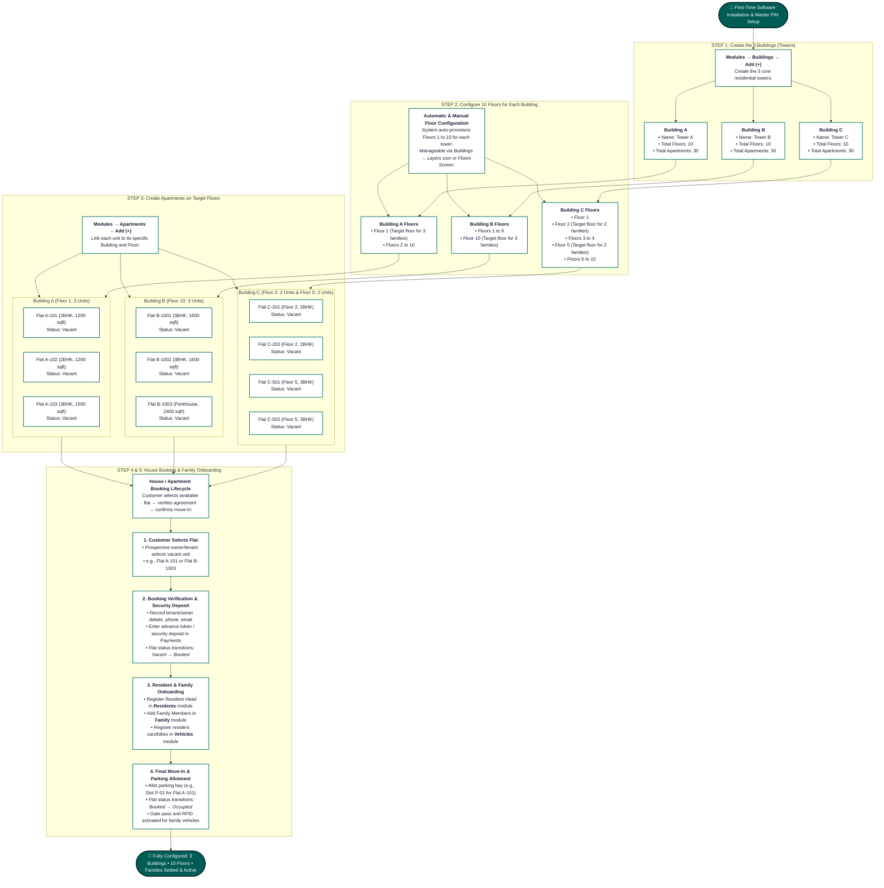
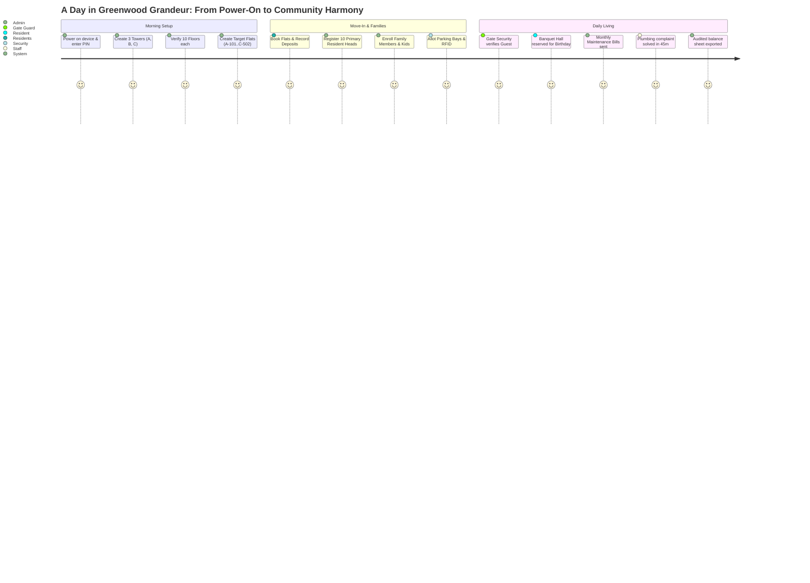

# AMS Local: Complete End-to-End System & Module Data Flowchart

This document details the exact creation sequence, data relationships, and operational lifecycles across all 26 modules in **AMS Local (Apartment Management System)**.

---

## 1. Master End-to-End Flowchart Diagram

```mermaid
flowchart TD
    %% ==========================================
    %% STAGE 1: PHYSICAL INFRASTRUCTURE
    %% ==========================================
    subgraph S1["STAGE 1: Physical Infrastructure Setup"]
        direction TB
        COMM["1. Community Profile<br/><b>communities</b><br/>• Name, Address, Contact, PIN"]
        BLDG["2. Buildings / Towers<br/><b>buildings</b><br/>• Name, Total Floors, Total Units"]
        FLR["3. Floors / Levels<br/><b>floors</b><br/>• Floor #, Custom Name (G, 1, 2, B1)"]
        APT["4. Apartments / Units / Rooms<br/><b>apartments</b><br/>• Number (101), Type (2BHK), Area (sqft)<br/>• Status (Vacant / Occupied / Rented)"]
        PRK["5. Parking Slots<br/><b>parking_slots</b><br/>• Slot # (P-01), Type (Car / Bike)"]

        COMM -->|"1:N (community_id)"| BLDG
        BLDG -->|"1:N (building_id) Auto-generated"| FLR
        BLDG -->|"1:N (building_id)"| APT
        FLR -->|"1:N (floor_id)"| APT
        APT -->|"1:1 Optional (apartment_id)"| PRK
    end

    %% ==========================================
    %% STAGE 2: CUSTOMER / RESIDENT ONBOARDING
    %% ==========================================
    subgraph S2["STAGE 2: Resident / Customer Onboarding"]
        direction TB
        RES["6. Residents / Customers<br/><b>residents</b><br/>• Name, Phone, Email, Move-in Date<br/>• Role: Owner / Tenant"]
        FAM["7. Family / Dependents<br/><b>family_members</b><br/>• Name, Relation, Age"]
        VEH["8. Registered Vehicles<br/><b>vehicles</b><br/>• Plate #, Vehicle Type, Model"]

        APT -->|"1:N (apartment_id)<br/>Changes status to Occupied"| RES
        RES -->|"1:N (resident_id)"| FAM
        RES -->|"1:N (resident_id)"| VEH
        VEH -.->|"Authorized to park in"| PRK
    end

    %% ==========================================
    %% STAGE 3: AMENITIES, BOOKINGS & GATE ACCESS
    %% ==========================================
    subgraph S3["STAGE 3: Amenities, Bookings & Daily Gate Flow"]
        direction TB
        AMEN["9. Amenities Catalog<br/><b>amenities</b><br/>• Clubhouse, Pool, Gym, Tennis Court<br/>• Capacity & Slot Limits"]
        BOOK["10. Facility Bookings<br/><b>facility_bookings</b><br/>• Date, Time Slot, Status (Booked)"]
        VIS["11. Front Gate Visitors<br/><b>visitors</b><br/>• Guest Name, Phone, Purpose, Vehicle #"]
        PASS["12. Gate Passes<br/><b>visitor_passes</b><br/>• Verification Code, Validity Window"]
        STAFF["13. Staff Registry<br/><b>staff</b><br/>• Security, Cleaners, Guards, Salary"]
        ATT["14. Daily Attendance<br/><b>staff_attendance</b><br/>• Date, Shift, Present / Absent"]

        AMEN -->|"1:N (amenity_id)"| BOOK
        APT -->|"1:N (apartment_id)<br/>Resident books amenity"| BOOK

        APT -->|"1:N (apartment_id)<br/>Visit destination flat"| VIS
        VIS -->|"1:1 (visitor_id)<br/>Entry authorization"| PASS
        STAFF -->|"1:N (staff_id)<br/>Daily clock-in"| ATT
    end

    %% ==========================================
    %% STAGE 4: MAINTENANCE BILLING & PAYMENTS
    %% ==========================================
    subgraph S4["STAGE 4: Maintenance Billing & Payment Cycle"]
        direction TB
        MCAT["15. Billing Categories<br/><b>maintenance_categories</b><br/>• Base Water, DG Power, Sinking Fund"]
        MBILL["16. Monthly Maintenance Bills<br/><b>maintenance_bills</b><br/>• Month, Year, Due Date, Total Amount<br/>• Status (Unpaid / Paid / Overdue)"]
        BITEM["17. Line Item Breakdown<br/><b>bill_items</b><br/>• Item Description, Charge Amount"]
        PAY["18. Payment Receipts<br/><b>payments</b><br/>• Settled Amount, Date, Mode (UPI/Cash)<br/>• Transaction Reference"]

        MCAT -.->|"Configures charge types"| BITEM
        APT -->|"1:N (apartment_id)<br/>Monthly billing cycle"| MBILL
        MBILL -->|"1:N (bill_id) Itemized details"| BITEM
        MBILL -->|"1:N (bill_id)<br/>Settles invoice to PAID"| PAY
    end

    %% ==========================================
    %% STAGE 5: OPEX, EXPENSES & VENDORS
    %% ==========================================
    subgraph S5["STAGE 5: OPEX, Vendors & Procurement"]
        direction TB
        VEND["19. Vendors & Contractors<br/><b>vendors</b><br/>• Plumbing, Lift AMC, Electrician, Pest"]
        ECAT["20. Expense Categories<br/><b>expense_categories</b><br/>• Utilities, Repairs, Fuel, Wages"]
        EXP["21. Society Expenses<br/><b>expenses</b><br/>• Amount, Description, Invoice Date"]
        VPAY["22. Vendor Payouts<br/><b>vendor_payments</b><br/>• Disbursed Amount, Date, Voucher"]

        VEND -->|"1:N (vendor_id)"| EXP
        ECAT -->|"1:N (category_id)"| EXP
        VEND -->|"1:N (vendor_id)"| VPAY
    end

    %% ==========================================
    %% STAGE 6: GOVERNANCE, ASSETS & HELPDESK
    %% ==========================================
    subgraph S6["STAGE 6: Governance, Helpdesk & Asset Care"]
        direction TB
        ASSET["23. Physical Assets<br/><b>assets</b><br/>• STP Plant, DG Genset, Lifts, Pumps"]
        AMAINT["24. Asset Service Logs<br/><b>asset_maintenance</b><br/>• Service Date, Cost, Technician"]
        COMP["25. Complaints & Tickets<br/><b>complaints</b><br/>• Water Leak, Noise, Priority, Status"]
        COMMNT["26. Ticket Comments<br/><b>complaint_comments</b><br/>• Action Taken, Resolution Note"]
        NOTIC["27. Digital Notices<br/><b>notices</b><br/>• Broadcast Title, Circular Content, Priority"]
        EVT["28. Community Events<br/><b>events</b><br/>• Festival, AGM Meeting, Sports Day"]
        DOC["29. Document Vault<br/><b>documents</b><br/>• Society Bylaws, Deeds, NOCs, Audits"]

        ASSET -->|"1:N (asset_id)"| AMAINT
        APT -->|"1:N (apartment_id)<br/>Reported by unit"| COMP
        COMP -->|"1:N (complaint_id)"| COMMNT
        COMM -.->|"Broadcasts to all residents"| NOTIC
        COMM -.->|"Engages community in"| EVT
    end

    %% ==========================================
    %% STAGE 7: AUDIT, TELEMETRY & REPORTING
    %% ==========================================
    subgraph S7["STAGE 7: Executive Telemetry & Offline Snapshots"]
        direction TB
        AUDIT["30. Audit Trail<br/><b>audit_logs</b><br/>• User Action, Timestamp, Entity ID"]
        REPS["31. Financial & Operational Reports<br/><b>Analytics Engine</b><br/>• Recovery %, Cashflow, OPEX Breakdown"]
        BACKUP["32. SQLite Local Vault<br/><b>Encrypted .db File</b><br/>• Zero Cloud Dependency, Offline Sync"]

        PAY -.->|"Collections Inflow"| REPS
        EXP -.->|"Expense Outflow"| REPS
        VPAY -.->|"Contractor Outflow"| REPS
        S1 -.->|"Structural telemetry"| AUDIT
        S2 -.->|"Resident changes"| AUDIT
        S4 -.->|"Financial entries"| AUDIT
        REPS -->|"Complete snapshot export"| BACKUP
    end

    %% Key Process Connections Across Subgraphs
    S1 ==>|"Units ready for occupancy"| S2
    S2 ==>|"Residents access facilities"| S3
    S2 ==>|"Invoices issued to occupied units"| S4
    S4 ==>|"Surplus reserves fund maintenance & vendors"| S5
    S5 -.->|"Vendor technicians service equipment"| S6
    S4 & S5 ==>|"Consolidated financial telemetry"| S7

    %% Styling
    classDef infra fill:#e0f2fe,stroke:#0284c7,stroke-width:2px,color:#0f172a;
    classDef resident fill:#dcfce7,stroke:#16a34a,stroke-width:2px,color:#0f172a;
    classDef gate fill:#fef3c7,stroke:#d97706,stroke-width:2px,color:#0f172a;
    classDef finance fill:#fee2e2,stroke:#dc2626,stroke-width:2px,color:#0f172a;
    classDef opex fill:#f3e8ff,stroke:#9333ea,stroke-width:2px,color:#0f172a;
    classDef govern fill:#ffedd5,stroke:#ea580c,stroke-width:2px,color:#0f172a;
    classDef audit fill:#f1f5f9,stroke:#475569,stroke-width:2px,color:#0f172a;

    class COMM,BLDG,FLR,APT,PRK infra;
    class RES,FAM,VEH resident;
    class AMEN,BOOK,VIS,PASS,STAFF,ATT gate;
    class MCAT,MBILL,BITEM,PAY finance;
    class VEND,ECAT,EXP,VPAY opex;
    class ASSET,AMAINT,COMP,COMMNT,NOTIC,EVT,DOC govern;
    class AUDIT,REPS,BACKUP audit;
```



---

## 2. Comprehensive Module Matrix: What Each Module Means & What is Inside It

Below is the complete reference table detailing **what each module means in real-world society management**, **the exact data fields stored inside it**, **why it is required**, and **how it connects to other modules**:

| Step | Module & Table | What It Means (Real-World Concept) | What is Inside It (Data Fields & Attributes) | Why It's Needed & How It Connects |
|:---:|:---|:---|:---|:---|
| **1** | **Community**<br/>`communities` | **The Root Legal Society Profile**.<br/>Represents the entire gated residential complex or co-operative housing society (e.g., *"Sunrise Heights Co-operative Housing Society"*). | • `id` *(Primary Key)*<br/>• `name` *(Official registered name)*<br/>• `address`, `city`, `state`, `pincode`<br/>• `contact_number`, `email`<br/>• `created_at` *(Timestamp)* | **The foundation of everything**.<br/>Acts as the master parent for all towers. Its address and contact info appear on all printed invoices, receipts, and circulars. |
| **2** | **Buildings / Towers**<br/>`buildings` | **The Physical Residential Towers / Blocks**.<br/>Represents individual architectural towers or wings inside the society (e.g., *"Tower A"*, *"Tower B"*, *"East Wing"*). | • `id` *(Primary Key)*<br/>• `community_id` *(Links to Community)*<br/>• `name` *(e.g. Tower A)*<br/>• `total_floors` *(e.g. 5 floors)*<br/>• `total_apartments` *(e.g. 20 flats)*<br/>• `created_at` *(Timestamp)* | **Organizes vertical infrastructure**.<br/>Setting `total_floors` automatically triggers floor generation. Holds the apartments belonging to this tower. |
| **3** | **Floors**<br/>`floors` | **The Vertical Levels / Tiers**.<br/>Represents the specific level inside a building (e.g., *Ground Floor*, *Floor 1*, *Floor 2*, *Basement -1*). | • `id` *(Primary Key)*<br/>• `building_id` *(Links to Building)*<br/>• `floor_number` *(Integer: -1, 0, 1, 2...)*<br/>• `name` *(Custom label, e.g. "Ground Floor", "Mezzanine")* | **Crucial for apartment addressing**.<br/>Ensures apartments are placed on the right level. Shows up in dropdowns as *"Tower A - Floor 1"*. |
| **4** | **Apartments / Units**<br/>`apartments` | **Individual Flats / Homes / Doors**.<br/>The actual living units where families reside (e.g., *Flat 101*, *Flat A-204*, *Penthouse 1*). | • `id` *(Primary Key)*<br/>• `building_id` *(Links to Building)*<br/>• `floor_id` *(Links to Floor)*<br/>• `apartment_number` *(e.g. "A-204")*<br/>• `type` *(1BHK, 2BHK, 3BHK, Studio, Penthouse)*<br/>• `area_sqft` *(e.g. 1250 sq.ft)*<br/>• `status` *('vacant', 'occupied', 'rented')* | **The central anchor of the whole system**.<br/>Everything links to the apartment: Residents live here, Parking slots are assigned here, Maintenance bills are issued here, and Visitors arrive here. |
| **5** | **Parking Slots**<br/>`parking_slots` | **Vehicle Parking Bays**.<br/>Designated car or two-wheeler parking spots in stilt, basement, or open areas (e.g., *P-12*, *B1-04*). | • `id` *(Primary Key)*<br/>• `apartment_id` *(Optional link to assigned flat)*<br/>• `slot_number` *(e.g. "P-14")*<br/>• `type` *(Covered 4-Wheeler, Open 2-Wheeler)* | **Prevents parking disputes**.<br/>Links an allotted bay to an apartment. Validates that a resident's registered vehicle parks in the correct spot. |
| **6** | **Residents / Customers**<br/>`residents` | **The Primary Occupants / Customers**.<br/>The head of the house—either the property owner or the registered tenant. | • `id` *(Primary Key)*<br/>• `apartment_id` *(Links to Apartment)*<br/>• `name` *(e.g. "John Doe")*<br/>• `phone`, `email`<br/>• `type` *('owner' or 'tenant')*<br/>• `move_in_date` *(Date)* | **Turns a vacant flat into an active home**.<br/>Flips apartment status to 'occupied'. The resident receives maintenance bills, books amenities, and authorizes gate visitors. |
| **7** | **Family Members**<br/>`family_members` | **Dependents & Relatives**.<br/>Family members living in the apartment (e.g., spouse, children, parents). | • `id` *(Primary Key)*<br/>• `resident_id` *(Links to Resident)*<br/>• `name` *(e.g. "Jane Doe")*<br/>• `relation` *(Spouse, Child, Parent)*<br/>• `age` *(Integer)* | **Ensures gate security & headcounts**.<br/>Used by security guards to verify family members entering the campus without needing a visitor pass. |
| **8** | **Vehicles**<br/>`vehicles` | **Resident Vehicles**.<br/>Registered four-wheelers and two-wheelers belonging to society residents. | • `id` *(Primary Key)*<br/>• `resident_id` *(Links to Resident)*<br/>• `vehicle_number` *(Plate: "KA-03-MG-4122")*<br/>• `type` *(Car, Motorcycle, Scooter)*<br/>• `model` *(e.g. "Honda City White")* | **Automated gate entry & security**.<br/>Recognized at the security booth. Validates authorized campus entry against allocated parking slots. |
| **9** | **Amenities / Facilities**<br/>`amenities` | **Shared Society Facilities Catalog**.<br/>Recreational and common facilities provided for community use. | • `id` *(Primary Key)*<br/>• `name` *(e.g. "Clubhouse Hall", "Gym", "Pool")*<br/>• `description` *(Rules, timings)*<br/>• `capacity` *(Max persons, e.g. 100)* | **Master facility directory**.<br/>Defines which facilities exist so residents can reserve time slots. |
| **10** | **Facility Bookings**<br/>`facility_bookings` | **Time-Slotted Reservations**.<br/>Bookings made by residents to reserve a facility for a party, meeting, or game. | • `id` *(Primary Key)*<br/>• `amenity_id` *(Links to Amenity)*<br/>• `apartment_id` *(Links to Flat/Resident)*<br/>• `date`, `start_time`, `end_time`<br/>• `status` *('booked', 'cancelled', 'completed')* | **Prevents booking clashes**.<br/>Manages the community calendar. Can trigger amenity rental surcharges on the resident's monthly bill. |
| **11** | **Front Gate Visitors**<br/>`visitors` | **External Guests, Deliveries & Cabs**.<br/>Logs every non-resident person entering through the security gate booth. | • `id` *(Primary Key)*<br/>• `apartment_id` *(Target flat being visited)*<br/>• `name` *(Guest name)*, `phone`<br/>• `purpose` *(Guest, Amazon Delivery, Uber, Plumber)*<br/>• `entry_time`, `exit_time` | **The security shield of the society**.<br/>Allows guards to record who entered, which flat they visited, and when they left. |
| **12** | **Visitor Passes**<br/>`visitor_passes` | **Digital Entry Pass / Clearance OTP**.<br/>Pre-authorized gate passes generated for expected guests or delivery couriers. | • `id` *(Primary Key)*<br/>• `visitor_id` *(Links to Visitor)*<br/>• `code` *(6-digit numeric pass code or OTP)*<br/>• `valid_from`, `valid_to` *(Validity window)* | **Fast, friction-free gate clearance**.<br/>The visitor shows the code or QR at the security gate to enter without phone delays. |
| **13** | **Staff Roster**<br/>`staff` | **Society Employees Registry**.<br/>Personnel hired for daily operations (security guards, sweepers, gardeners, managers). | • `id` *(Primary Key)*<br/>• `name` *(e.g. "Ramesh Kumar")*<br/>• `role` *(Security Guard, Housekeeper, Electrician)*<br/>• `phone`<br/>• `salary` *(Monthly wage)*, `join_date` | **Human resource management**.<br/>Tracks who works for the society and determines monthly payroll liabilities. |
| **14** | **Staff Attendance**<br/>`staff_attendance` | **Daily Shift & Clock-In Logs**.<br/>Day-to-day attendance tracking for all society staff members. | • `id` *(Primary Key)*<br/>• `staff_id` *(Links to Staff)*<br/>• `date` *(YYYY-MM-DD)*<br/>• `status` *('present', 'absent', 'half_day', 'on_leave')* | **Payroll accuracy**.<br/>Calculates net working days at month-end to generate staff wage expenses. |
| **15** | **Billing Categories**<br/>`maintenance_categories` | **Master Types of Maintenance Dues**.<br/>Configures standard billing heads used across invoices. | • `id` *(Primary Key)*<br/>• `name` *(e.g. "Water Charges", "Base Maintenance", "DG Backup", "Sinking Fund")* | **Defines invoice line-item structure**.<br/>Allows the society to charge transparent, categorized line items on invoices. |
| **16** | **Maintenance Bills**<br/>`maintenance_bills` | **Monthly Society Invoices**.<br/>The official invoice issued to each flat every billing cycle for shared maintenance costs. | • `id` *(Primary Key)*<br/>• `apartment_id` *(Links to Flat)*<br/>• `month` *(1..12)*, `year` *(e.g. 2026)*<br/>• `amount` *(Total payable, e.g. Rs. 3,100)*<br/>• `due_date` *(Payment deadline)*<br/>• `status` *('unpaid', 'paid', 'overdue')* | **The core financial revenue engine**.<br/>Tracks who owes what. Drives society collection progress, defaulter lists, and pending dues telemetry. |
| **17** | **Bill Line Items**<br/>`bill_items` | **Itemized Charge Breakdown**.<br/>The individual transparent items that sum up to the total bill amount. | • `id` *(Primary Key)*<br/>• `bill_id` *(Links to Maintenance Bill)*<br/>• `description` *(e.g. "Base Maintenance", "Clubhouse Surcharge", "Late Fine")*<br/>• `amount` *(e.g. Rs. 2,500, Rs. 400, Rs. 200)* | **Transparency for residents**.<br/>Shows residents exactly what they are paying for on printable PDF invoices and receipts. |
| **18** | **Payments & Receipts**<br/>`payments` | **Settlement Receipts**.<br/>Recorded whenever a resident pays their maintenance invoice. | • `id` *(Primary Key)*<br/>• `bill_id` *(Links to Maintenance Bill)*<br/>• `amount` *(Amount paid, e.g. Rs. 3,100)*<br/>• `payment_date` *(Date)*<br/>• `mode` *(UPI, Cash, Cheque, Bank Transfer)*<br/>• `reference` *(Transaction ID / Cheque #)* | **Settles debts and funds society reserves**.<br/>Flips bill status to 'paid', drops pending dues to Rs. 0, and increases society cash balance. |
| **19** | **Vendors & Contractors**<br/>`vendors` | **Contractors & Service Providers**.<br/>Third-party agencies engaged for society maintenance contracts and repairs. | • `id` *(Primary Key)*<br/>• `name` *(e.g. "Otis Elevator Co.", "CleanPro Pest")*<br/>• `category` *(Plumbing, Electrical, Lifts, STP, Landscaping)*<br/>• `phone`, `email` | **Supplier & contractor directory**.<br/>Linked to service contracts, helpdesk ticket dispatches, and vendor payout vouchers. |
| **20** | **Expense Categories**<br/>`expense_categories` | **OPEX Accounting Classification**.<br/>Standard accounting heads to track where society funds are spent. | • `id` *(Primary Key)*<br/>• `name` *(e.g. "Utilities", "Repairs", "Salaries", "Diesel", "Housekeeping")* | **Financial categorization**.<br/>Used to generate category-wise expense donut charts and annual audit reports. |
| **21** | **Society Expenses**<br/>`expenses` | **Operational Outflow Records (OPEX)**.<br/>Every disbursement paid out from society funds to keep the campus running. | • `id` *(Primary Key)*<br/>• `category_id` *(Links to Expense Category)*<br/>• `vendor_id` *(Optional link to Vendor)*<br/>• `description` *(e.g. "Diesel for DG Generator - 200 Litres")*<br/>• `amount` *(e.g. Rs. 18,500)*<br/>• `date` *(Date)* | **Tracks society cash outflow**.<br/>Subtracted from collections inflow to compute the Net Reserve surplus/deficit. |
| **22** | **Vendor Payouts**<br/>`vendor_payments` | **Contractor Payment Vouchers**.<br/>Formal payment records disbursed to external vendors for services rendered. | • `id` *(Primary Key)*<br/>• `vendor_id` *(Links to Vendor)*<br/>• `amount` *(e.g. Rs. 12,000)*<br/>• `date` *(Date)*<br/>• `description` *(e.g. "Q3 Lift AMC Maintenance Settlement")* | **Vendor ledger management**.<br/>Ensures external agencies are paid accurately and prevents duplicate billing. |
| **23** | **Physical Assets**<br/>`assets` | **Capital Machinery & Equipment**.<br/>Valuable machinery, plant equipment, and infrastructure owned by the society. | • `id` *(Primary Key)*<br/>• `name` *(e.g. "Cummins 125 kVA Diesel Generator", "Kirloskar Water Pump #2", "Schindler Passenger Lift")*<br/>• `category` *(Power, Water, Elevator, Security)*<br/>• `purchase_date`, `value` *(Valuation)*<br/>• `location` *(e.g. "Basement Utility Room")* | **Asset management & depreciation**.<br/>Maintains equipment inventory and ensures critical infrastructure receives scheduled maintenance. |
| **24** | **Asset Maintenance**<br/>`asset_maintenance` | **Preventative Service & Repair Logs**.<br/>History of routine service, oil changes, filter renewals, or emergency repairs on assets. | • `id` *(Primary Key)*<br/>• `asset_id` *(Links to Asset)*<br/>• `date` *(Service date)*<br/>• `description` *(e.g. "Engine oil changed, air filters replaced")*<br/>• `cost` *(e.g. Rs. 4,200)* | **Prevents equipment breakdowns**.<br/>Maintains machinery warranty logs and feeds maintenance costs into the expense ledger. |
| **25** | **Complaints / Helpdesk**<br/>`complaints` | **Resident Service Requests & Grievances**.<br/>Tickets reported by residents regarding apartment issues or campus malfunctions. | • `id` *(Primary Key)*<br/>• `apartment_id` *(Links to Flat reporting issue)*<br/>• `title` *(e.g. "Water leakage in kitchen pipe")*<br/>• `description`<br/>• `priority` *('low', 'normal', 'urgent')*<br/>• `status` *('open', 'in_progress', 'resolved')* | **Resident satisfaction & ticket resolution**.<br/>Alerts the manager, dispatches a plumber/electrician, and tracks resolution speed. |
| **26** | **Complaint Comments**<br/>`complaint_comments` | **Ticket Progress Logs & Action Notes**.<br/>Activity logs recorded by technicians or managers while resolving a complaint. | • `id` *(Primary Key)*<br/>• `complaint_id` *(Links to Complaint)*<br/>• `comment` *(e.g. "Replaced washer and inlet pipe valve. Leak stopped.")*<br/>• `date` *(Timestamp)* | **Accountability and resolution audit**.<br/>Provides a transparent history of repairs before marking the complaint 'resolved'. |
| **27** | **Digital Notices**<br/>`notices` | **Broadcast Circulars & Announcements**.<br/>Official bulletins published by the managing committee for all society members. | • `id` *(Primary Key)*<br/>• `title` *(e.g. "Water Supply Shutdown on Wednesday")*<br/>• `content` *(Detailed instructions)*<br/>• `date` *(Broadcast date)*<br/>• `priority` *('normal', 'urgent')* | **Community communication**.<br/>Displayed instantly on the digital notice board and mobile app dashboard. |
| **28** | **Community Events**<br/>`events` | **Social, Cultural & AGM Meetings**.<br/>Festivals, sports days, celebrations, or formal Annual General Body meetings. | • `id` *(Primary Key)*<br/>• `name` *(e.g. "Diwali Cultural Night", "Annual General Meeting 2026")*<br/>• `description`<br/>• `date`, `venue` *(e.g. "Clubhouse Amphitheater")* | **Community engagement**.<br/>Helps coordinate society events and books relevant campus venues. |
| **29** | **Documents Vault**<br/>`documents` | **Legal, Municipal & Compliance Vault**.<br/>Repository of critical society deeds, sanction plans, bylaws, and certificates. | • `id` *(Primary Key)*<br/>• `title` *(e.g. "Society Registration Certificate", "Fire Safety NOC 2026", "Society Bylaws")*<br/>• `category` *(Legal, Compliance, Architectural, Financial)*<br/>• `file_path` *(Local device path)*<br/>• `upload_date` *(Timestamp)* | **Legal compliance & record preservation**.<br/>Keeps vital documents securely archived offline for immediate committee inspection. |
| **30** | **Audit Trail**<br/>`audit_logs` | **Security & Activity Tracking Log**.<br/>Automatic audit record of every administrative action taken in the app. | • `id` *(Primary Key)*<br/>• `action` *(e.g. "CREATE_BILL", "DELETE_RESIDENT", "RECORD_PAYMENT")*<br/>• `entity` *(Table name)*, `entity_id`<br/>• `user_id`, `timestamp` | **Zero-tamper accountability**.<br/>Provides a clear chronological trail of who changed what in the database. |
| **31** | **Analytics Engine**<br/>*(In-Memory Query Engine)* | **Financial & Operational Intelligence**.<br/>Real-time computational layer calculating society health indicators. | • Computes: Total Billed, Total Collected, Collection Recovery %, Pending Defaulters, OPEX Breakdown, Cashflow Trends, Net Reserve Balance. | **Executive decision making**.<br/>Powers the live KPI widgets, recovery progress bars, and OPEX donut charts. |
| **32** | **SQLite Local Vault**<br/>`apartment_mgmt.db` | **Encrypted On-Device Database File**.<br/>The master physical database file stored locally on the phone or tablet. | • Contains all 32 relational tables, indexes, constraints, and WAL journal.<br/>• Zero cloud dependence. 100% offline. | **Data sovereignty & privacy**.<br/>Guarantees that all resident data stays securely on your device, with one-tap backup & restore. |

---

## 3. End-to-End Operational Lifecycle Walkthrough

### Flow A: From Brick to Room (Infrastructure Setup)
$$\text{Community Profile} \longrightarrow \text{Building / Tower} \longrightarrow \text{Floors (1..N)} \longrightarrow \text{Apartments (Rooms)} \longrightarrow \text{Parking Slots}$$
1. **Community Profile**: Create the legal entity (e.g. *Sunrise Heights CHS*).
2. **Tower / Building**: Add *Tower A* with `total_floors: 5`.
3. **Floors Auto-Generation**: The system auto-generates *Floor 1*, *Floor 2*, *Floor 3*, *Floor 4*, and *Floor 5*. Custom floors (e.g. *Ground Floor*, *Basement*) can be renamed or added.
4. **Apartment / Room**: Under *Tower A* and *Floor 2*, create flat *A-204* (2BHK, 1,200 sqft, initial status: *Vacant*).
5. **Parking Allocation**: Create parking slot *P-14* (Covered Car) linked to apartment *A-204*.

### Flow B: Customer Onboarding & Living (Resident Lifecycle)
$$\text{Apartment A-204} \longrightarrow \text{Resident (Customer/Owner)} \longrightarrow \text{Family Members} \longrightarrow \text{Vehicles} \longrightarrow \text{Move-In Date}$$
1. **Resident Registration**: Onboard *John Doe* as *Owner* into flat *A-204*. The apartment status switches to **Occupied**.
2. **Family Dependents**: Add spouse and children linked to *John Doe*.
3. **Vehicle Registration**: Register car `KA-03-MG-4122` linked to *John Doe* and allocated to slot *P-14*.

### Flow C: Amenities Booking & Gate Operations
$$\text{Amenity (Clubhouse)} \longrightarrow \text{Resident Booking} \longrightarrow \text{Visitor Arrives} \longrightarrow \text{Gate Pass} \longrightarrow \text{Check-In} \longrightarrow \text{Stay} \longrightarrow \text{Exit}$$
1. **Amenity Catalog**: Admin registers *Clubhouse Party Hall* with capacity 100.
2. **Booking**: Resident of flat *A-204* books Clubhouse for an evening birthday slot.
3. **Guest Arrival**: Guest vehicle arrives at security gate. Security enters visitor name visiting unit *A-204*.
4. **Gate Pass & Check-In**: Instant security pass generated. Security checks in guest (**Check-In**).
5. **Stay & Exit**: After the event, security records exit timestamp (**Check-Out**).

### Flow D: Monthly Maintenance Billing & Payment Cycle
$$\text{Monthly Cycle} \longrightarrow \text{Bill Generated} \longrightarrow \text{Line Items Added} \longrightarrow \text{Invoice Sent} \longrightarrow \text{Payment Recorded} \longrightarrow \text{Receipt Issued}$$
1. **Billing Cycle Trigger**: On the 1st of the month, admin triggers the October cycle for all 48 units.
2. **Invoice Generation**: Invoice generated for *Flat A-204* for `Rs. 3,100` due in 15 days (Status: **Unpaid**).
3. **Itemized Line Items**:
   - Base Maintenance: `Rs. 2,500`
   - Clubhouse Surcharge: `Rs. 400`
   - Sinking Fund: `Rs. 200`
4. **Payment Settled**: Resident pays via UPI/Cash. Admin records payment with reference `UPI-982314`.
5. **Status Update**: Bill status immediately flips to **PAID**, outstanding receivables decrease, and telemetry updates live.

### Flow E: OPEX, Vendors & Helpdesk
$$\text{Complaint Logged} \longrightarrow \text{Staff / Vendor Dispatched} \longrightarrow \text{Work Resolved} \longrightarrow \text{Vendor Payout} \longrightarrow \text{Expense Recorded}$$
1. **Complaint Logged**: Resident of *A-204* reports *Water pipeline leakage in kitchen*.
2. **Vendor Dispatch**: Admin checks *Plumbing Vendor* and dispatches technician.
3. **Resolution**: Technician repairs leak. Admin adds work log comment and marks ticket **Resolved**.
4. **Vendor Payout & Expense**: Plumbing invoice paid (`Rs. 850`) and recorded under *Plumbing Repairs* expense category.
5. **Financial Telemetry**: Net Reserve = Collections minus OPEX updated on Reports dashboard.

---

## 4. Master Top-to-Bottom Sequential Execution Flowchart

The following diagram illustrates the complete, continuous top-to-bottom execution path from initial foundation to day-to-day living, booking, gate security, maintenance billing, and settlement:

```mermaid
flowchart TD
    START([🏁 START: Empty Database Initialization]) --> STEP1

    %% ----------------------------------------------------
    %% PHASE 1: PHYSICAL INFRASTRUCTURE
    %% ----------------------------------------------------
    subgraph P1["PHASE 1: Physical Infrastructure Building"]
        direction TB
        STEP1["<b>1. Create Community Profile</b><br/>• Name: Sunrise Heights CHS<br/>• Address, City, Pincode, Email, Office Phone"]
        STEP2["<b>2. Create Buildings / Towers</b><br/>• Tower A (Total Floors: 5, Total Units: 20)<br/>• Tower B (Total Floors: 4, Total Units: 16)"]
        STEP3["<b>3. Auto-Generate & Label Floors</b><br/>• Floors 1..5 auto-created in database<br/>• Custom floors: Ground Floor (0), Basement (-1)"]
        STEP4["<b>4. Create Apartments / Rooms</b><br/>• Flat Number: A-204 (Tower A, Floor 2)<br/>• Type: 2BHK | Area: 1,250 sqft | Status: Vacant"]
        STEP5["<b>5. Allot Parking Slots</b><br/>• Slot P-14 (Covered 4-Wheeler)<br/>• Assigned to Flat A-204"]

        STEP1 --> STEP2 --> STEP3 --> STEP4 --> STEP5
    end

    %% ----------------------------------------------------
    %% PHASE 2: RESIDENT ONBOARDING
    %% ----------------------------------------------------
    subgraph P2["PHASE 2: Resident (Customer) Onboarding"]
        direction TB
        STEP6["<b>6. Register Resident / Customer</b><br/>• Name: John Doe | Phone: +91 98765 43210<br/>• Role: Owner | Move-in Date: 2026-10-01<br/>• Flat Status switches from 'Vacant' to 'Occupied'"]
        STEP7["<b>7. Add Family Dependents</b><br/>• Jane Doe (Spouse, 32)<br/>• Leo Doe (Child, 6)"]
        STEP8["<b>8. Register Vehicles</b><br/>• Car: KA-03-MG-4122 (Honda City White)<br/>• Authorized for Slot P-14 & RFID Gate Tag"]

        STEP6 --> STEP7 --> STEP8
    end

    %% ----------------------------------------------------
    %% PHASE 3: AMENITY RESERVATION & GATE PASS
    %% ----------------------------------------------------
    subgraph P3["PHASE 3: Amenities, Booking & Visitor Flow"]
        direction TB
        STEP9["<b>9. Setup Amenities Catalog</b><br/>• Clubhouse Party Hall (Capacity: 100)<br/>• Swimming Pool, Gymnasium, Tennis Court"]
        STEP10["<b>10. Resident Books Facility</b><br/>• Unit A-204 reserves Clubhouse<br/>• Date: 2026-10-12 | Time: 18:00 - 22:00"]
        STEP11["<b>11. Front Gate Visitor Arrives</b><br/>• Guest vehicle KA-05-AB-1234 at main gate<br/>• Visiting Flat A-204 for Birthday Event"]
        STEP12["<b>12. Gate Pass & Check-In</b><br/>• Guard enters phone & generates pass<br/>• Resident approves -> Check-In logged"]
        STEP13["<b>13. Guest Stay on Campus</b><br/>• Visitor attends event in Clubhouse / Flat"]
        STEP14["<b>14. Gate Check-Out</b><br/>• Vehicle leaves campus through Tower B Gate<br/>• Security logs Exit Timestamp in SQLite"]

        STEP9 --> STEP10 --> STEP11 --> STEP12 --> STEP13 --> STEP14
    end

    %% ----------------------------------------------------
    %% PHASE 4: MONTHLY BILLING & PAYMENT
    %% ----------------------------------------------------
    subgraph P4["PHASE 4: Monthly Billing & Payment Settlement"]
        direction TB
        STEP15["<b>15. Configure Billing Categories</b><br/>• Base Maintenance, Water, DG Power, Sinking Fund"]
        STEP16["<b>16. Generate Monthly Invoices</b><br/>• Cycle: October 2026 (All 48 units)<br/>• Unit A-204 Invoice created (Status: UNPAID)"]
        STEP17["<b>17. Itemize Line Items Breakdown</b><br/>• Monthly Base Maintenance: Rs. 2,500<br/>• Clubhouse Event Surcharge: Rs. 400<br/>• Sinking Fund: Rs. 200<br/>• Total Payable: Rs. 3,100 (Due in 15 days)"]
        STEP18["<b>18. Resident Makes Payment</b><br/>• John Doe pays Rs. 3,100 via UPI (UPI-982314)<br/>• Alternatively pays via Cash / Cheque at society office"]
        STEP19["<b>19. Record Payment & Settle Invoice</b><br/>• Invoice status flips from UNPAID to PAID<br/>• Pending Dues drop to Rs. 0<br/>• Digital Receipt generated & shared"]

        STEP15 --> STEP16 --> STEP17 --> STEP18 --> STEP19
    end

    %% ----------------------------------------------------
    %% PHASE 5: OPEX, VENDORS & HELPDESK
    %% ----------------------------------------------------
    subgraph P5["PHASE 5: Maintenance Tickets, Vendors & OPEX"]
        direction TB
        STEP20["<b>20. Resident Reports Complaint</b><br/>• Flat A-204 logs: 'Kitchen pipe leak'<br/>• Priority: Urgent | Status: Open"]
        STEP21["<b>21. Dispatch Vendor / Staff</b><br/>• Plumber from 'Express Plumbing Agency' dispatched<br/>• Work log notes recorded in Ticket Comments"]
        STEP22["<b>22. Work Resolved & Ticket Closed</b><br/>• Pipe washer replaced | Leak stopped<br/>• Status marked RESOLVED"]
        STEP23["<b>23. Vendor Payout & Society Expense</b><br/>• Vendor payment voucher: Rs. 850<br/>• Expense categorized under 'Repairs & Maintenance'"]

        STEP20 --> STEP21 --> STEP22 --> STEP23
    end

    %% ----------------------------------------------------
    %% PHASE 6: EXECUTIVE TELEMETRY & BACKUP
    %% ----------------------------------------------------
    subgraph P6["PHASE 6: Executive Telemetry & Snapshot Vault"]
        direction TB
        STEP24["<b>24. Live Executive Telemetry</b><br/>• Collections Inflow (+) minus OPEX Outflow (-)<br/>• Live Recovery Rate: 98% Collected<br/>• Net Society Reserve Surplus updated"]
        STEP25["<b>25. Offline Encrypted SQLite Snapshot</b><br/>• All 32 tables saved in on-device database<br/>• Exportable to encrypted backup (.db / JSON)"]

        STEP24 --> STEP25
    end

    %% Inter-Phase Transitions
    STEP5 ==>|"Physical unit ready for tenant"| STEP6
    STEP8 ==>|"Occupant active on campus"| STEP9
    STEP14 ==>|"End of month cycle triggered"| STEP15
    STEP19 ==>|"Society generates maintenance surplus"| STEP20
    STEP23 ==>|"All revenues and costs consolidated"| STEP24
    STEP25 ==> FINISH([🏆 END: 100% Offline Gated Society Running Smoothly])

    %% Styling
    classDef stepNode fill:#ffffff,stroke:#0f766e,stroke-width:2px,color:#131b2e;
    classDef startEnd fill:#005c55,stroke:#00201d,stroke-width:2px,color:#ffffff;
    class START,FINISH startEnd;
    class STEP1,STEP2,STEP3,STEP4,STEP5,STEP6,STEP7,STEP8,STEP9,STEP10,STEP11,STEP12,STEP13,STEP14,STEP15,STEP16,STEP17,STEP18,STEP19,STEP20,STEP21,STEP22,STEP23,STEP24,STEP25 stepNode;
```



---

### Step-by-Step Transition Guide for the Top-to-Bottom Flow

1. **Step 1 to Step 5 (Brick to Door)**: 
   You first define the legal society (`Community`), add physical towers (`Buildings`), auto-generate vertical tiers (`Floors`), partition into living spaces (`Apartments`), and allocate vehicle bays (`Parking Slots`).
2. **Step 6 to Step 8 (Living Campus)**: 
   Once a flat is created, onboarding a `Resident` flips its state to **Occupied**. Linking their `Family Members` and `Vehicles` guarantees gate recognition and parking enforcement.
3. **Step 9 to Step 14 (Daily Operations & Access)**: 
   Residents can reserve shared facilities (`Amenities` & `Facility Bookings`). External guests arrive at the front gate, receive verified `Visitor Passes`, complete **Check-In**, stay on campus, and record their **Check-Out** upon departure.
4. **Step 15 to Step 19 (Revenue & Settlement)**: 
   Every month, the automated billing engine issues `Maintenance Bills` categorized with transparent `Bill Items`. Upon payment, a `Payment` receipt is logged and the invoice transitions to **PAID**.
5. **Step 20 to Step 23 (Care & Upkeep)**: 
   Resident maintenance tickets (`Complaints`) dispatch vetted `Vendors` or `Staff`. Once work is certified, `Vendor Payments` record society `Expenses`.
6. **Step 24 to Step 25 (Audit & Sovereignty)**: 
   All financial and operational events update real-time telemetry gauges (Recovery %, Net Reserve) and persist securely into the on-device encrypted SQLite database.

---

## 5. Apartment / Building Booking Process (Multi-Building 10-Floor Scenario)

This section details the practical, first-time setup and booking lifecycle for a large residential society consisting of **3 Buildings**, where each building has **10 Floors**, and specific floors host multiple families/apartments:

- **Building A**: 3 families on the 1st floor (Flats `A-101`, `A-102`, `A-103`).
- **Building B**: 3 families on the 10th floor (Flats `B-1001`, `B-1002`, `B-1003`).
- **Building C**: 2 families on the 2nd floor (Flats `C-201`, `C-202`) and 2 families on the 5th floor (Flats `C-501`, `C-502`).

---

### Step-by-Step Execution Sequence

When the software is installed on the device for the first time, follow this strict sequential chain:

$$\text{1. Buildings (A, B, C)} \longrightarrow \text{2. Floors (1..10 each)} \longrightarrow \text{3. Apartments on Specific Floors} \longrightarrow \text{4. Families / Residents} \longrightarrow \text{5. House Booking \& Move-In}$$



---

### Detailed Society Structural Mapping Matrix

| Building | Floor Level | Apartment / Flat # | Flat Configuration | Family / Resident Head | Family Members | Assigned Parking | House Booking Status |
|:---|:---|:---|:---|:---|:---:|:---:|:---:|
| **Building A** | **Floor 1** | **A-101** | 2BHK (1,200 sqft) | Sharma Family (*Rajesh Sharma*) | 4 Members | Slot P-A01 | **Occupied** *(Booked & Moved In)* |
| **Building A** | **Floor 1** | **A-102** | 2BHK (1,200 sqft) | Patel Family (*Amit Patel*) | 3 Members | Slot P-A02 | **Occupied** *(Booked & Moved In)* |
| **Building A** | **Floor 1** | **A-103** | 3BHK (1,500 sqft) | Verma Family (*Suresh Verma*) | 5 Members | Slot P-A03 | **Occupied** *(Booked & Moved In)* |
| **Building A** | Floors 2–10 | *Available Units* | 1BHK, 2BHK, 3BHK | *Unassigned* | — | *Open Pool* | **Vacant** *(Available for Booking)* |
| **Building B** | Floors 1–9 | *Available Units* | 2BHK, 3BHK | *Unassigned* | — | *Open Pool* | **Vacant** *(Available for Booking)* |
| **Building B** | **Floor 10** | **B-1001** | 3BHK (1,600 sqft) | Mehta Family (*Karan Mehta*) | 4 Members | Slot P-B10 | **Occupied** *(Booked & Moved In)* |
| **Building B** | **Floor 10** | **B-1002** | 3BHK (1,600 sqft) | Kapoor Family (*Rohan Kapoor*) | 3 Members | Slot P-B11 | **Occupied** *(Booked & Moved In)* |
| **Building B** | **Floor 10** | **B-1003** | Penthouse (2,400 sqft) | Singhania Family (*Vikram Singhania*) | 4 Members | Slot P-B12 | **Occupied** *(Booked & Moved In)* |
| **Building C** | Floor 1 | *Available Units* | 2BHK | *Unassigned* | — | *Open Pool* | **Vacant** *(Available for Booking)* |
| **Building C** | **Floor 2** | **C-201** | 2BHK (1,150 sqft) | Iyer Family (*Venkatesh Iyer*) | 3 Members | Slot P-C03 | **Occupied** *(Booked & Moved In)* |
| **Building C** | **Floor 2** | **C-202** | 2BHK (1,150 sqft) | Nair Family (*Pradeep Nair*) | 2 Members | Slot P-C04 | **Occupied** *(Booked & Moved In)* |
| **Building C** | Floors 3–4 | *Available Units* | 2BHK, 3BHK | *Unassigned* | — | *Open Pool* | **Vacant** *(Available for Booking)* |
| **Building C** | **Floor 5** | **C-501** | 3BHK (1,450 sqft) | Reddy Family (*Anand Reddy*) | 4 Members | Slot P-C09 | **Occupied** *(Booked & Moved In)* |
| **Building C** | **Floor 5** | **C-502** | 3BHK (1,450 sqft) | Das Family (*Subhash Das*) | 3 Members | Slot P-C10 | **Occupied** *(Booked & Moved In)* |
| **Building C** | Floors 6–10 | *Available Units* | 3BHK | *Unassigned* | — | *Open Pool* | **Vacant** *(Available for Booking)* |

---

### Step-by-Step Implementation in the App

1. **Step 1: Create the 3 Buildings**
   - Open **Modules** → tap **Buildings** → tap **+ (Add)**.
   - Enter **Building Name**: `Building A` (or `Tower A`), set **Total Floors**: `10`, **Total Apartments**: `30` → tap **Save**.
   - Repeat the same for `Building B` and `Building C`.
2. **Step 2: Confirm Floors Generation**
   - In **Modules** → **Buildings**, tap the **Layers icon** (`layers_outlined`) on each building or tap **All Floors**.
   - The app has automatically generated Floors 1 to 10 for each of the 3 buildings.
3. **Step 3: Add Apartments on Specific Floors**
   - Open **Modules** → tap **Apartments** → tap **+ (Add)**.
   - For Building A: Select **Building A** → select **Floor 1** → add Flat `A-101` (2BHK), `A-102` (2BHK), `A-103` (3BHK).
   - For Building B: Select **Building B** → select **Floor 10** → add Flat `B-1001` (3BHK), `B-1002` (3BHK), `B-1003` (Penthouse).
   - For Building C: Select **Building C** → select **Floor 2** → add Flat `C-201`, `C-202`; then select **Floor 5** → add Flat `C-501`, `C-502`.
4. **Step 4 & 5: Book the House & Onboard the Families**
   - When a family books a flat (e.g. *Rajesh Sharma* books *A-101*):
   - Go to **Modules** → **Residents** → tap **+ (Add)**.
   - Select Apartment `A-101`, enter name *Rajesh Sharma*, phone, and role (*Owner*).
   - Once saved, flat `A-101` automatically transitions from **Vacant** to **Occupied**.
   - Go to **Modules** → **Family** to add spouse/children.
   - Go to **Modules** → **Vehicles** to register cars for gate security & parking bay allotment.

---

## 6. The Complete Society Story: Day 1 Launch to Daily Living (Module-by-Module Journey)

### Prologue: Meet the Society & The Administrator
*Welcome to **"Greenwood Grandeur Residential Community"**, a modern township featuring **3 grand residential towers (Building A, Building B, Building C)**, each standing **10 floors tall**.*

*The Management Committee has just handed a new tablet to **Mr. Arvind Kumar**, the Society General Manager. The device has AMS Local installed. Arvind powers on the screen to configure the township from scratch and welcome the first 10 families into their new homes:*
- **Building A (Floor 1)**: Sharma Family (A-101), Patel Family (A-102), Verma Family (A-103)
- **Building B (Floor 10 - Sky Residences)**: Mehta Family (B-1001), Kapoor Family (B-1002), Singhania Family (B-1003)
- **Building C (Floor 2 & Floor 5)**: 
  - Floor 2: Iyer Family (C-201), Nair Family (C-202)
  - Floor 5: Reddy Family (C-501), Das Family (C-502)

Here is the exact story of how Arvind sets up the entire society, module by module, and how daily life unfolds seamlessly.

---

### Act 1: First Power-On & Master Administration Setup
**Modules Involved**: `App Security`, `Auth PIN`, `Society Profile`

1. **Unboxing & First Launch**:
   - Arvind taps the AMS Local app icon on his tablet.
   - The screen displays the **First-Time Master Setup** prompt.
2. **Setting the Master PIN**:
   - Arvind sets a secure 6-digit Master PIN: `889900` and enables Biometric / Fingerprint login.
3. **Configuring the Society Profile**:
   - Under **Settings → Society Profile**, Arvind enters:
     - **Society Name**: *Greenwood Grandeur RWA*
     - **Address**: *Plot 42, Outer Ring Road, Green Valley, Tech Corridor*
     - **Contact**: *manager@greenwoodgrandeur.org | +91 98765 43210*
     - **Fiscal Year**: *April 1 – March 31*
   - Tapping **Save Society Profile** creates the root administrative record in the local database.

---

### Act 2: Constructing the Towers (Module: Buildings)
**Modules Involved**: `Buildings`

Arvind navigates to **Modules → Buildings** to set up the physical layout.

```
[Modules] ➔ [Buildings] ➔ [+ Add Building]
```

1. **Building A (Tower A - Sapphire)**:
   - Name: `Building A`
   - Total Floors: `10`
   - Total Apartments: `30`
   - Tap **Save**.
2. **Building B (Tower B - Emerald)**:
   - Name: `Building B`
   - Total Floors: `10`
   - Total Apartments: `30`
   - Tap **Save**.
3. **Building C (Tower C - Diamond)**:
   - Name: `Building C`
   - Total Floors: `10`
   - Total Apartments: `30`
   - Tap **Save**.

*The dashboard now shows 3 Buildings created with a total capacity of 30 floors and 90 apartments.*

---

### Act 3: Going Vertical — The 10 Floors (Module: Floors)
**Modules Involved**: `Floors`

Arvind needs to ensure that every building has its 10 floors properly mapped.

1. **Automatic Floor Provisioning**:
   - Arvind opens **Modules → Buildings** and taps the **Layers icon** on `Building A`.
   - The system has already automatically provisioned **Floor 1 through Floor 10** (`Floor 1`, `Floor 2`, ..., `Floor 10`) linked to `building_id: A`.
2. **Verification for Building B & Building C**:
   - Arvind inspects `Building B`: Floors 1 to 10 are active.
   - Arvind inspects `Building C`: Floors 1 to 10 are active.
3. **Customization (Optional)**:
   - Arvind opens **Modules → Floors**, taps on *Floor 10 of Building B*, and edits its label to `Floor 10 (Penthouse & Sky Suites)` for premium clarity.

---

### Act 4: Laying Out the Apartments (Module: Apartments)
**Modules Involved**: `Apartments`

Now, Arvind configures the specific flats where the families will reside.

```
[Modules] ➔ [Apartments] ➔ [+ Add Flat]
```

1. **Building A — Floor 1 (3 Units)**:
   - Flat `A-101`: Building: `Building A`, Floor: `Floor 1`, Type: `2BHK`, Area: `1,200 sqft`, Status: `Vacant`.
   - Flat `A-102`: Building: `Building A`, Floor: `Floor 1`, Type: `2BHK`, Area: `1,200 sqft`, Status: `Vacant`.
   - Flat `A-103`: Building: `Building A`, Floor: `Floor 1`, Type: `3BHK`, Area: `1,500 sqft`, Status: `Vacant`.
2. **Building B — Floor 10 (3 Units)**:
   - Flat `B-1001`: Building: `Building B`, Floor: `Floor 10`, Type: `3BHK`, Area: `1,600 sqft`, Status: `Vacant`.
   - Flat `B-1002`: Building: `Building B`, Floor: `Floor 10`, Type: `3BHK`, Area: `1,600 sqft`, Status: `Vacant`.
   - Flat `B-1003`: Building: `Building B`, Floor: `Floor 10`, Type: `Penthouse`, Area: `2,400 sqft`, Status: `Vacant`.
3. **Building C — Floor 2 & Floor 5 (4 Units)**:
   - Flat `C-201`: Building: `Building C`, Floor: `Floor 2`, Type: `2BHK`, Area: `1,150 sqft`, Status: `Vacant`.
   - Flat `C-202`: Building: `Building C`, Floor: `Floor 2`, Type: `2BHK`, Area: `1,150 sqft`, Status: `Vacant`.
   - Flat `C-501`: Building: `Building C`, Floor: `Floor 5`, Type: `3BHK`, Area: `1,450 sqft`, Status: `Vacant`.
   - Flat `C-502`: Building: `Building C`, Floor: `Floor 5`, Type: `3BHK`, Area: `1,450 sqft`, Status: `Vacant`.

*All 10 target flats now appear in the inventory with bright blue 'Vacant' status badges.*

---

### Act 5: Demarcating Basement Parking Bays (Module: Parking Slots)
**Modules Involved**: `Parking Slots`

To avoid parking disputes upon move-in, Arvind configures dedicated parking slots:
- **Tower A Basement**: Arvind creates slots `P-A01`, `P-A02`, `P-A03` (Basement Level -1).
- **Tower B Basement**: Arvind creates slots `P-B10`, `P-B11`, `P-B12` (Basement Level -1).
- **Tower C Basement**: Arvind creates slots `P-C03`, `P-C04` (Floor 2 allotments) and `P-C09`, `P-C10` (Floor 5 allotments).
*All parking bays are marked as `Available`.*

---

### Act 6: Club Facilities & Maintenance Tariff Setup (Modules: Amenities & Pricing)
**Modules Involved**: `Amenities`, `Pricing & Tariffs`

Arvind configures the shared community facilities and billing rules:
1. **Amenities Configuration**:
   - `Clubhouse Banquet Hall`: ₹1,500/session, max capacity 100 people.
   - `Olympic Swimming Pool`: Free for residents, slot timing 6:00 AM – 9:00 PM.
   - `Fitness Center & Gym`: Free for residents.
   - `Badminton Court`: ₹100/hour slot reservation.
2. **Maintenance Tariff Rules**:
   - `2BHK Standard Rate`: ₹3,500 / month (covers water, 24/7 security, lift, common power).
   - `3BHK Premium Rate`: ₹4,500 / month.
   - `Penthouse Luxury Rate`: ₹7,000 / month.

---

### Act 7: The House Booking Ceremony (Module: Bookings & Agreements)
**Modules Involved**: `Customers / Inquiries`, `Apartment Booking`, `Payments`

The families visit the management office to complete their house booking and move-in agreements:

1. **Building A — Floor 1 Bookings**:
   - **Mr. Rajesh Sharma** books Flat `A-101`: Pays ₹1,00,000 advance token deposit via Cheque #440121. Arvind records the transaction under **Payments**.
   - **Mr. Amit Patel** books Flat `A-102`: Pays token deposit via Bank NEFT.
   - **Mr. Suresh Verma** books Flat `A-103`: Pays token deposit via UPI.
2. **Building B — Floor 10 Bookings**:
   - **Mr. Karan Mehta** books Flat `B-1001`.
   - **Mr. Rohan Kapoor** books Flat `B-1002`.
   - **Mr. Vikram Singhania** books Penthouse `B-1003` with exclusive terrace rights.
3. **Building C — Floor 2 & 5 Bookings**:
   - **Mr. Venkatesh Iyer** (C-201) & **Mr. Pradeep Nair** (C-202) book Floor 2 flats.
   - **Mr. Anand Reddy** (C-501) & **Mr. Subhash Das** (C-502) book Floor 5 flats.

*Each flat status automatically transitions from `Vacant` to `Booked`.*

---

### Act 8: Welcoming the Primary Residents (Module: Residents)
**Modules Involved**: `Residents`, `Apartments`

Move-in day arrives! Arvind opens **Modules → Residents** and officially registers each family head.

```
[Modules] ➔ [Residents] ➔ [+ Add Resident]
```

1. **Registering Sharma Family Head**:
   - Name: `Rajesh Sharma` | Phone: `98111-22334` | Email: `rajesh.sharma@example.com`
   - Flat: `A-101 (Building A, Floor 1)` | Type: `Owner` | Move-in Date: `2026-09-01`
   - Assigned Parking: `P-A01`
   - Tap **Save** ➔ Flat `A-101` automatically transitions from `Booked` to **Occupied**!
2. **Registering All Remaining Resident Heads**:
   - Flat `A-102` ➔ `Amit Patel` (Owner) ➔ Assigned `P-A02` ➔ **Occupied**
   - Flat `A-103` ➔ `Suresh Verma` (Owner) ➔ Assigned `P-A03` ➔ **Occupied**
   - Flat `B-1001` ➔ `Karan Mehta` (Owner) ➔ Assigned `P-B10` ➔ **Occupied**
   - Flat `B-1002` ➔ `Rohan Kapoor` (Tenant) ➔ Assigned `P-B11` ➔ **Occupied**
   - Flat `B-1003` ➔ `Vikram Singhania` (Owner) ➔ Assigned `P-B12` ➔ **Occupied**
   - Flat `C-201` ➔ `Venkatesh Iyer` (Owner) ➔ Assigned `P-C03` ➔ **Occupied**
   - Flat `C-202` ➔ `Pradeep Nair` (Tenant) ➔ Assigned `P-C04` ➔ **Occupied**
   - Flat `C-501` ➔ `Anand Reddy` (Owner) ➔ Assigned `P-C09` ➔ **Occupied**
   - Flat `C-502` ➔ `Subhash Das` (Owner) ➔ Assigned `P-C10` ➔ **Occupied**

*All 10 flats in Buildings A, B, and C now display solid emerald 'Occupied' badges.*

---

### Act 9: Enrolling Every Family Member (Module: Family Members)
**Modules Involved**: `Family Members`

Arvind now records all family members living inside each unit to ensure society identity passes and club privileges:

```
[Modules] ➔ [Family Members] ➔ [+ Add Member]
```

1. **Sharma Family (Flat A-101)**:
   - Primary Resident: `Rajesh Sharma`
   - Member 1: `Sunita Sharma` (Spouse, Age 42, Phone: 98111-22335)
   - Member 2: `Rohan Sharma` (Son, Age 16)
   - Member 3: `Ananya Sharma` (Daughter, Age 12)
2. **Mehta Family (Flat B-1001)**:
   - Primary Resident: `Karan Mehta`
   - Member 1: `Priya Mehta` (Spouse)
   - Member 2: `Aryan Mehta` (Son, Age 8)
   - Member 3: `Devi Mehta` (Mother, Senior Citizen)
3. **Singhania Family (Flat B-1003)**:
   - Primary Resident: `Vikram Singhania`
   - Member 1: `Radhika Singhania` (Spouse)
   - Member 2: `Tara Singhania` (Daughter, Age 7)
   - Member 3: `Veer Singhania` (Son, Age 4)
4. *Arvind repeats the same quick entry for the Patel, Verma, Kapoor, Iyer, Nair, Reddy, and Das families.*

---

### Act 10: Registering Vehicles & Smart Boom-Barrier Access (Module: Vehicles)
**Modules Involved**: `Vehicles`, `Parking Slots`

To prevent unauthorized parking and automate gate entry:

```
[Modules] ➔ [Vehicles] ➔ [+ Add Vehicle]
```

1. **Building A Vehicles**:
   - `Rajesh Sharma (A-101)`: White Honda City `KA-01-MJ-1001` ➔ Linked to Bay `P-A01`.
   - `Amit Patel (A-102)`: Grey Hyundai Creta `KA-01-PT-2002` ➔ Linked to Bay `P-A02`.
   - `Suresh Verma (A-103)`: Maroon Toyota Innova `KA-01-VM-3003` ➔ Linked to Bay `P-A03`.
2. **Building B Vehicles**:
   - `Karan Mehta (B-1001)`: Blue Kia Seltos `KA-02-MH-4004` ➔ Linked to Bay `P-B10`.
   - `Rohan Kapoor (B-1002)`: Black Skoda Slavia `KA-02-KP-5005` ➔ Linked to Bay `P-B11`.
   - `Vikram Singhania (B-1003)`: Silver Mercedes GLC `KA-02-SG-9999` ➔ Linked to Bay `P-B12`.
3. **Building C Vehicles**:
   - `Venkatesh Iyer (C-201)`: White Maruti Baleno `KA-03-IY-1101` ➔ Linked to Bay `P-C03`.
   - `Pradeep Nair (C-202)`: Red Tata Nexon `KA-03-NR-2202` ➔ Linked to Bay `P-C04`.
   - `Anand Reddy (C-501)`: Silver Mahindra XUV700 `KA-03-RD-5501` ➔ Linked to Bay `P-C09`.
   - `Subhash Das (C-502)`: Grey Honda Elevate `KA-03-DS-6602` ➔ Linked to Bay `P-C10`.

*Security guards at Gate 1 and Gate 2 can now scan number plates and RFID tags against the database.*

---

### Act 11: Deploying the Society Workforce (Module: Staff & Security)
**Modules Involved**: `Staff`, `Security Guards`

Arvind onboards the essential society team:
- **Security Team**:
  - `Ramesh Thapa`: Head Security Guard, assigned to **Main Gate 1** (Day Shift).
  - `Sunil Gurung`: Patrol Guard, assigned to **Building A, B, and C Basements & Towers**.
- **Maintenance Team**:
  - `Mahesh Yadav`: Certified Society Plumber.
  - `Kishore Lal`: Society Electrician.
- **Housekeeping**:
  - `Anita Bai`: Dedicated floor attendant for Towers A and B.

---

### Act 12: Daily Life in Greenwood Grandeur — Real Operations Across All Modules

Now the society is fully alive! Let's follow how daily events trigger every module:

#### Event 12.1: A Guest Arrives for the Sharma Family (Module: Visitors)
- **10:15 AM**: A guest, *Mr. Alok Verma*, arrives at **Main Gate 1** requesting entry to **Flat A-101**.
- Guard *Ramesh Thapa* opens **Modules → Visitors → + Add Visitor**:
  - Visitor Name: `Alok Verma` | Phone: `98444-12345`
  - Visiting: `Flat A-101 (Rajesh Sharma)` | Purpose: `Personal Visit`
  - Vehicle: `KA-05-XY-8812`
- Guard taps **Generate Gate Pass**. An SMS / in-app notification alerts Rajesh Sharma.
- The guard admits the guest. Upon departure at 1:30 PM, the guard taps **Check-Out**, timestamping the exit.

#### Event 12.2: Birthday Party in the Clubhouse (Module: Amenity Bookings)
- **2:00 PM**: *Vikram Singhania* (Penthouse B-1003) wants to host his daughter Tara's 7th birthday celebration this Sunday.
- He visits the office. Arvind opens **Modules → Amenity Bookings → + Book Amenity**:
  - Amenity: `Clubhouse Banquet Hall`
  - Resident: `Vikram Singhania (B-1003)`
  - Date & Time: `Upcoming Sunday, 5:00 PM – 10:00 PM`
  - Fee: `₹1,500`
- Arvind taps **Confirm Booking**. The Clubhouse calendar is locked for Sunday evening, preventing duplicate bookings.

#### Event 12.3: 1st of the Month Maintenance Billing (Module: Invoices & Billing)
- **1st of the Month, 8:00 AM**: Arvind runs the automated monthly maintenance bill generator:
  - Flats A-101, A-102, C-201, C-202 (2BHK): Invoiced `₹3,500` each.
  - Flats A-103, B-1001, B-1002, C-501, C-502 (3BHK): Invoiced `₹4,500` each.
  - Flat B-1003 (Penthouse): Invoiced `₹7,000`.
- 10 digital invoices are generated with unique invoice numbers (`INV-2026-09-001` through `010`) and due date set to the 10th of the month.

#### Event 12.4: Settling Dues & Generating Receipts (Module: Payments & Receipts)
- **3rd of the Month**:
  - *Amit Patel* (A-102) opens his app and pays `₹3,500` via UPI.
  - *Anand Reddy* (C-501) hands Arvind a cheque for `₹4,500`.
- Arvind records the payments in **Modules → Payments**:
  - Invoice `INV-2026-09-002` marks as **Paid**.
  - A PDF receipt (`REC-2026-0089`) with QR code verification is automatically generated and sent to Amit Patel.

#### Event 12.5: The Dripping Pipe Helpdesk Ticket (Module: Complaints & Helpdesk)
- **11:30 AM**: *Amit Patel* (A-102) notices water dripping from the kitchen ceiling pipe.
- Arvind opens **Modules → Complaints → + Log Complaint**:
  - Flat: `A-102` | Resident: `Amit Patel`
  - Category: `Plumbing` | Priority: `High`
  - Description: *Kitchen ceiling pipe joint dripping water.*
  - Assigned To: `Mahesh Yadav (Society Plumber)`
  - Status: `In Progress`
- Mahesh arrives at A-102, replaces the faulty washer within 45 minutes.
- Arvind updates the ticket to `Resolved`, adds notes: *W-Ring joint replaced, tested under high pressure.*
- Amit Patel confirms resolution with a 5-star rating.

#### Event 12.6: Emergency Society Broadcast (Module: Notice Board)
- **4:00 PM**: The municipal water board announces a 6-hour supply shutdown tomorrow for main pipeline repairs.
- Arvind opens **Modules → Notice Board → + Post Notice**:
  - Title: `Notice: Scheduled Municipal Water Supply Maintenance`
  - Target: `All Buildings (Building A, Building B, Building C)`
  - Priority: `Urgent`
  - Content: *Please store adequate water for tomorrow between 10:00 AM and 4:00 PM. Society backup borewell will operate as scheduled.*
- The notice is instantly broadcast across all residents' dashboards and printed on the digital notice boards in Tower A, B, and C lobbies.

#### Event 12.7: Society Vendor Expenses & Financial Audit (Modules: Expenses & Accounts)
- **End of the Month**:
  - Arvind opens **Modules → Expenses** to log society vendor disbursements:
    - *Voucher #EXP-101*: `Apex Security Agency` — ₹45,000 (Monthly security contract for 3 towers).
    - *Voucher #EXP-102*: `State Electricity Board` — ₹28,400 (Lift & common lighting power for Buildings A, B, C).
    - *Voucher #EXP-103*: `CleanPro Chemical Supplies` — ₹6,200 (Swimming pool chlorine & cleaning).
- Arvind clicks **Reports → Income vs Expense**:
  - Total Maintenance Collected: `₹43,500`
  - Total Facility Booking Revenue: `₹1,500`
  - Society Operating Expense: `₹79,600` (Balanced by Society Reserve Fund).
  - The society ledger balances to the rupee!

---

### Epilogue: Summary of Data Continuity Across the 3 Buildings



Every module in AMS Local connects together in a continuous, unbroken chain:
$$\text{Security PIN} \to \text{Buildings} \to \text{Floors} \to \text{Flats} \to \text{Residents} \to \text{Families} \to \text{Vehicles} \to \text{Gate Visitors} \to \text{Billing} \to \text{Receipts}$$
The entire residential township is now self-sufficient, secure, and digitally powered!


