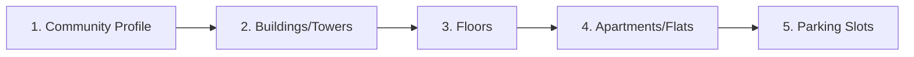
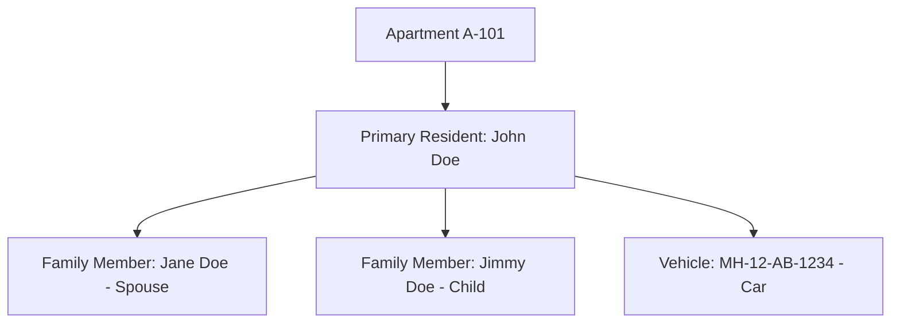

# Apartment Management System — Comprehensive User Manual & Operational Guide

Welcome to the **Apartment Management System**! This manual is designed for Society Chairmen, Secretaries, Property Managers, and Administrative Staff. It explains how to use every feature in the app from a practical, real-world perspective—without technical or programming jargon.

---

## Table of Contents
1. [First-Time Launch & Security Setup](#1-first-time-launch--security-setup)
2. [Navigating the App](#2-navigating-the-app)
3. [Phase 1: Setting Up the Society Foundation](#3-phase-1-setting-up-the-society-foundation)
   - [Step 1: Community Profile](#step-1-community-profile)
   - [Step 2: Buildings / Towers](#step-2-buildings--towers)
   - [Step 3: Floors](#step-3-floors)
   - [Step 4: Apartments / Flats](#step-4-apartments--flats)
   - [Step 5: Parking Slots](#step-5-parking-slots)
4. [Phase 2: Resident & Family Onboarding](#4-phase-2-resident--family-onboarding)
   - [Registering Residents](#registering-residents)
   - [Adding Family Members](#adding-family-members)
   - [Registering Vehicles](#registering-vehicles)
5. [Phase 3: Financial & Billing Operations](#5-phase-3-financial--billing-operations)
   - [Generating Monthly Maintenance Bills](#generating-monthly-maintenance-bills)
   - [Adding Custom Line Items to a Bill](#adding-custom-line-items-to-a-bill)
   - [Recording Resident Payments](#recording-resident-payments)
   - [Recording Society Expenses & Vendor Payments](#recording-society-expenses--vendor-payments)
6. [Phase 4: Day-to-Day Society Operations](#6-phase-4-day-to-day-society-operations)
   - [Gate Security & Visitor Tracking](#gate-security--visitor-tracking)
   - [Complaints & Helpdesk](#complaints--helpdesk)
   - [Facility & Amenity Booking](#facility--amenity-booking)
   - [Notice Board & Events](#notice-board--events)
   - [Staff & Daily Attendance](#staff--daily-attendance)
   - [Society Assets & Equipment Care](#society-assets--equipment-care)
   - [Document Vault](#document-vault)
7. [Phase 5: Financial Reports & Society Health](#7-phase-5-financial-reports--society-health)
8. [Phase 6: Data Safety, Backups & Settings](#8-phase-6-data-safety-backups--settings)
   - [Creating a Backup](#creating-a-backup)
   - [Sharing / Exporting Backups](#sharing--exporting-backups)
   - [Restoring from a Backup](#restoring-from-a-backup)
   - [Changing the Security PIN](#changing-the-security-pin)
9. [Feature Interconnection Matrix](#9-feature-interconnection-matrix)

---

## 1. First-Time Launch & Security Setup

When you open the application for the very first time:

```
┌──────────────────────────────────────────────┐
│             Set up Master PIN                │
│                                              │
│   Create a 4-digit numeric code to secure    │
│   your society records on this device.       │
│                                              │
│               [  • • • •  ]                  │
│                                              │
│               [ Confirm PIN ]                │
└──────────────────────────────────────────────┘
```

1. **Create Master PIN**: Enter a 4-digit secret PIN of your choice.
2. **Confirm PIN**: Re-type the same 4 digits to confirm.
3. **Daily Unlocking**: Whenever you open or restart the app in the future, enter this PIN on the **Login Screen** to gain entry.
> **Note**: Because this application works completely offline for privacy, your PIN is stored directly on your device. Keep this PIN safe.

---

## 2. Navigating the App

Once unlocked, the app provides a straightforward **two-tab navigation bar** at the bottom of the screen:

```
┌─────────────────────────────────────────────────────────────┐
│ 🏠 Overview (Dashboard)                                     │
│ ├── Quick stats: Total Flats, Residents, Pending Dues       │
│ └── Shortcuts to urgent complaints and bills                │
├─────────────────────────────────────────────────────────────┤
│ 📑 Modules (Directory)                                      │
│ └── Grid of all 26 feature modules                          │
└─────────────────────────────────────────────────────────────┘
```

- **Tab 1: Dashboard (Overview)**: Real-time pulse of your society—how many apartments are occupied, how much maintenance money is pending, and open complaints needing attention.
- **Tab 2: Modules**: The full command center where you access specific tools (Residents, Maintenance, Visitors, Staff, Parking, etc.).

---

## 3. Phase 1: Setting Up the Society Foundation

Before adding residents or bills, you build the physical layout of your community. Follow this order:



### Step 1: Community Profile
1. Go to **Modules** → Tap **Community**.
2. Tap the **+ (Add)** button.
3. Fill in your society details:
   - **Name**: e.g., *Sunrise Heights Co-operative Housing Society*
   - **Address, City, State, Pincode**
   - **Office Phone & Email**
4. Tap **Save**.

### Step 2: Buildings / Towers
1. Go to **Modules** → Tap **Buildings**.
2. Tap **+ (Add)**.
3. Select your **Community** from the dropdown.
4. Enter the **Building Name** (e.g., *Tower A*, *Block B*, or *East Wing*).
5. Specify Total Floors and estimated Total Apartments.
6. Tap **Save**. Repeat for all towers in your society.

### Step 3: Floors
- **Automatic Creation**: When you enter **Total Floors** while creating or editing a **Building** (e.g., 5 floors), the app automatically generates Floor 1 through Floor 5 for that building.
- **Managing / Custom Floors**:
  1. Go to **Modules** → Tap **Buildings** → Tap the **Layers icon** (or the top **All Floors** button) or go to **Apartments** → Tap **Manage Floors**.
  2. You can view all floors per building, tap **Edit** to give custom labels (e.g., rename `Floor 1` to `Ground Floor`, or `Floor -1` to `Basement 1`), or tap **+ Add Floor** for extra levels (e.g., *Terrace*, *Mezzanine*).
  3. Tap **Auto-Generate** in the top bar anytime to automatically sync floors with your building counts.

### Step 4: Apartments / Flats
1. Go to **Modules** → Tap **Apartments**.
2. Tap **+ (Add)**.
3. Select the **Building** and **Floor** (e.g., *Tower A - Floor 1* or *Tower A - Ground Floor*).
4. Enter the **Apartment Number** (e.g., *101*, *A-204*, *Penthouse 1*).
5. Enter the **Area (Sq. Ft.)** (e.g., *1250*) and **Type** (e.g., *2BHK*, *3BHK*).
6. Set the initial status to **Vacant**.
7. Tap **Save**.

### Step 5: Parking Slots
1. Go to **Modules** → Tap **Parking**.
2. Tap **+ (Add)**.
3. Enter the **Slot Number** (e.g., *P-12*, *B1-04*).
4. Choose the type (e.g., *Covered 4-Wheeler*, *Open 2-Wheeler*).
5. Link it to the designated **Apartment** from the dropdown list.
6. Tap **Save**.

---

## 4. Phase 2: Resident & Family Onboarding

Once your apartments exist in the system, you can assign occupants to them.



### Registering Residents
1. Go to **Modules** → Tap **Residents**.
2. Tap **+ (Add)**.
3. Select the resident's **Apartment** from the dropdown.
4. Enter the **Full Name**, **Phone Number**, and **Email Address**.
5. Select **Type**:
   - **Owner**: Resident owns the property.
   - **Tenant**: Resident is renting.
6. Select the **Move-in Date**.
7. Tap **Save**. The apartment is now considered occupied.

### Adding Family Members
1. Go to **Modules** → Tap **Family Members**.
2. Tap **+ (Add)**.
3. Select the primary **Resident** from the dropdown list.
4. Enter the member's **Name**, **Relationship** (e.g., *Spouse*, *Son*, *Parent*), and **Age**.
5. Tap **Save**.

### Registering Vehicles
1. Go to **Modules** → Tap **Vehicles**.
2. Tap **+ (Add)**.
3. Select the **Resident**.
4. Enter the **Vehicle Number / License Plate** (e.g., *MH-12-AB-1234*).
5. Enter the **Type** (*Car*, *Bike*, *EV*) and **Model** (e.g., *Honda City*).
6. Tap **Save**. Security can now verify parked vehicles against this directory.

---

## 5. Phase 3: Financial & Billing Operations

The financial lifecycle handles billing every apartment, collecting dues, itemizing special costs, and tracking society expenses.

```mermaid
sequenceDiagram
    autonumber
    actor Admin
    participant Bills as Maintenance Bills
    participant Details as Bill Details
    participant Pay as Payments
    participant Exp as Expenses
    
    Admin->>Bills: 1. Generate Bills for Month (e.g., Oct 2026, ₹2,500)
    Note over Bills: Generates "Unpaid" bills for all flats
    Admin->>Details: 2. (Optional) Add Line Item (e.g., ₹500 Water Tank Repair)
    Admin->>Details: 3. Record Payment when resident pays
    Details->>Pay: Creates Payment Record (Cash/UPI/Cheque)
    Note over Bills: Bill automatically updates to "Paid"
    Admin->>Exp: 4. Record Society Expenses (e.g., Security agency fee)
```

### Generating Monthly Maintenance Bills
Instead of creating bills one-by-one, the app generates them in batch:
1. Go to **Modules** → Tap **Maintenance Bills**.
2. Tap the blue **Generate Bills** button at the top right.
3. Select the **Month** and **Year** (e.g., *October 2026*).
4. Set the **Amount per apartment** (e.g., *₹2,500*).
5. Set the **Due Date** (e.g., 10 days from today).
6. By default, all apartments are selected. Uncheck any flat that should be excluded.
7. Tap **Generate**. Unpaid bills are instantly created for all selected units.

### Adding Custom Line Items to a Bill
If a specific flat owes an extra charge (penalty, clubhouse rental, plumbing repair):
1. In **Maintenance Bills**, tap on the resident's bill.
2. Scroll to **Line Items** → Tap **+ Add Item**.
3. Enter the description (e.g., *Late fee* or *Balcony repair*) and the amount.
4. Tap **Add**. The total bill amount updates automatically.

### Recording Resident Payments
When a resident transfers money or hands over cash/cheque:
1. Open **Maintenance Bills** and locate the bill (or search by flat number).
2. Tap on the bill to open its details.
3. Tap **Record Payment**.
4. Enter:
   - **Amount Paid** (defaults to full due amount)
   - **Mode**: Select *UPI*, *Cash*, *Cheque*, *Bank Transfer*, or *Card*
   - **Reference**: Enter UPI Transaction ID or Cheque Number (optional but recommended)
5. Tap **Record**.
6. The bill status changes to **Paid**, and the receipt is logged in the **Payments** module.

### Recording Society Expenses & Vendor Payments
When the society pays for electricity, lift servicing, or housekeeping:
1. Go to **Modules** → Tap **Expenses**.
2. Tap **+ (Add)**.
3. Select the **Category** (*Utilities*, *Repairs*, *Salaries*, *Housekeeping*, etc.).
4. Select the **Vendor** (if applicable).
5. Enter the **Amount**, **Date**, and a brief **Description** (e.g., *Common area electricity bill - Sep*).
6. Tap **Save**. This expenditure immediately reflects in your financial balance.

---

## 6. Phase 4: Day-to-Day Society Operations

### Gate Security & Visitor Tracking
Use this screen at the security gate:
1. Go to **Modules** → Tap **Visitors**.
2. When a visitor arrives: Tap **+ (Add)**.
3. Fill in:
   - **Visitor Name**
   - **Phone Number**
   - **Apartment** they are visiting (selected from dropdown)
   - **Purpose** (e.g., *Delivery*, *Guest*, *Cab*, *Service*)
4. Tap **Save**. The **Entry Time** is recorded automatically.
5. When the visitor leaves: Open their record and record their **Exit Time**.

### Complaints & Helpdesk
Track and resolve resident issues with full accountability:
1. Go to **Modules** → Tap **Complaints**.
2. Tap **+ (Add)** to log a grievance.
3. Select the **Apartment**, enter the **Title** (e.g., *Water leakage in master bathroom*), and describe the problem.
4. Set the **Priority** (*Low*, *Normal*, *High*, *Urgent*).
5. As work progresses, open the complaint and update its status from **Open** → **In Progress** → **Resolved**.
6. You can add internal notes in the comment section for a complete audit trail.

### Facility & Amenity Booking
Prevent scheduling conflicts for shared amenities:
1. **Define Amenities**: Go to **Amenities** to set up facilities (e.g., *Clubhouse*, *Swimming Pool*, *Party Lawn*, *Tennis Court*).
2. **Book a Facility**: Go to **Facility Bookings** → Tap **+ (Add)**.
3. Select the **Amenity**, the requesting **Apartment**, the **Date**, and **Start / End Time**.
4. If someone else already booked that slot, the admin can see the conflict before confirming.

### Notice Board & Events
1. **Post a Notice**: Go to **Notices** → Tap **+ (Add)**. Enter the notice title, detailed content, and priority (*Normal* or *Urgent*). Great for water shutdown alerts or AGM meetings.
2. **Schedule an Event**: Go to **Events** → Tap **+ (Add)**. Enter festival celebrations, cultural programs, or society elections with date and venue.

### Staff & Daily Attendance
1. **Staff Profiles**: Go to **Staff** to record security personnel, sweepers, plumbers, and electricians with their roles and monthly salaries.
2. **Attendance Log**: Go to **Staff Attendance** every morning. Select the staff member, choose the date, and mark status as **Present**, **Absent**, or **Half-day**.

### Society Assets & Equipment Care
Track costly community investments:
1. Go to **Assets** → Tap **+ (Add)**. Register major assets like *Diesel Generator 50kVA*, *Submersible Pump #1*, or *Elevator A*.
2. When serviced, go to **Asset Maintenance** and log the date, cost, and service details.

### Document Vault
Keep important papers organized without uploading them to any external cloud:
1. Go to **Modules** → Tap **Documents**.
2. Tap **+ (Add)**.
3. The app opens your device's native file explorer.
4. Select the file (PDF, Image, Contract).
5. Give it a **Title** (e.g., *Fire Safety NOC 2026*, *Lift AMC Agreement*) and a **Category**.
6. Tap **Save**. The document is securely linked directly from your device storage.

---

## 7. Phase 5: Financial Reports & Society Health

Go to **Modules** → Tap **Reports** (or access it from the Dashboard).

The screen presents four real-time cards calculated directly from your records:

```
┌──────────────────────────────┬──────────────────────────────┐
│  💰 Total Collected          │  ⏳ Pending Dues             │
│  All resident payments       │  All unpaid maintenance      │
│  received to date            │  bills waiting to be paid    │
├──────────────────────────────┼──────────────────────────────┤
│  📉 Total Expenses           │  💼 Net Balance              │
│  Sum of all society repairs, │  (Total Collected minus      │
│  salaries, and utility bills │  Total Expenses)             │
└──────────────────────────────┴──────────────────────────────┘
```

Below the cards, a **Monthly Collection Chart** displays a bar graph of collections over the last 6 months. This visual trend lets the committee quickly assess collection efficiency and spot payment drops before they affect society cash flow.

---

## 8. Phase 6: Data Safety, Backups & Settings

Because the application runs entirely on your local device without an external server, **regular backups are critical** to safeguard against lost or damaged phones/laptops.

### Creating a Backup
1. Go to **Modules** → Tap **Backup & Restore**.
2. Tap **Create Backup**.
3. The app instantly copies the database into a timestamped backup file (e.g., `backup_2026-09-17T11-00-00.db`).

### Sharing / Exporting Backups (Recommended Weekly)
Don't keep backups only on the same device:
1. In the **Backup & Restore** screen, locate your latest backup in the list.
2. Tap the **Share** icon next to it.
3. Choose your preferred app: **Save to Google Drive**, **Send via Email**, **Send to WhatsApp**, or **Save to SD Card / USB**.
4. If your device is ever lost or formatted, you can restore your complete society data from this exported file!

### Restoring from a Backup
1. In **Backup & Restore**, either tap an existing local backup from the list, or tap **Restore from File** to pick a `.db` file from your device storage or downloads folder.
2. Review the confirmation prompt carefully: *Restoring will replace all current data with the selected backup.*
3. Tap **Restore**. The database reloads instantly.

### Changing the Security PIN
1. Go to **Modules** → Tap **Settings**.
2. Tap **Change PIN**.
3. Enter your new 4-digit code and confirm it.

---

## 9. Feature Interconnection Matrix

How every screen connects to others inside the system:

| If You Create / Modify... | It Immediately Affects... | How It Connects |
|---|---|---|
| **Community** | Buildings | Buildings must belong to a Community. |
| **Building & Floor** | Apartments | Each apartment requires a Building & Floor selection. |
| **Apartment** | Residents, Bills, Parking, Visitors, Bookings, Complaints | All resident records, invoices, guest visits, and grievances link back to a specific apartment number. |
| **Resident** | Family Members, Vehicles | Family members and vehicles link to the primary resident's account. |
| **Generate Bills** | Maintenance Bills, Dashboard | Batch-creates unpaid bills; increases the **Pending Dues** counter on the Dashboard. |
| **Record Payment** | Maintenance Bills, Payments, Reports, Dashboard | Changes bill status to **Paid**; increases **Total Collected**; lowers **Pending Dues**; updates 6-month collection chart. |
| **Record Expense** | Expenses, Reports, Dashboard | Deducts from **Net Balance**; updates total expenditures on Reports. |
| **Log Complaint** | Complaints, Dashboard | Increments the **Open Complaints** counter on the Dashboard overview. |
| **Book Amenity** | Facility Bookings, Dashboard | Reserves the amenity for the selected apartment and reflects in **Upcoming Bookings** on the Dashboard. |
| **Any Create / Edit / Delete** | Audit Logs | Automatically records a timestamped audit trail of who changed what in the database. |

---

## 10. Summary: Quick Administrator Routine Checklist

- **Every Morning**: Check **Dashboard** → Mark **Staff Attendance** → Review **Visitors Log**.
- **1st of Every Month**: Open **Maintenance Bills** → Tap **Generate Bills** for the current month.
- **Throughout the Month**: Open specific bills to **Record Payments** as residents transfer money.
- **Every Weekend**: Log society utility/vendor **Expenses** → Check **Reports** for net balance.
- **Every Sunday Evening**: Go to **Backup & Restore** → Tap **Create Backup** → **Share** the backup file to your Google Drive or email.
