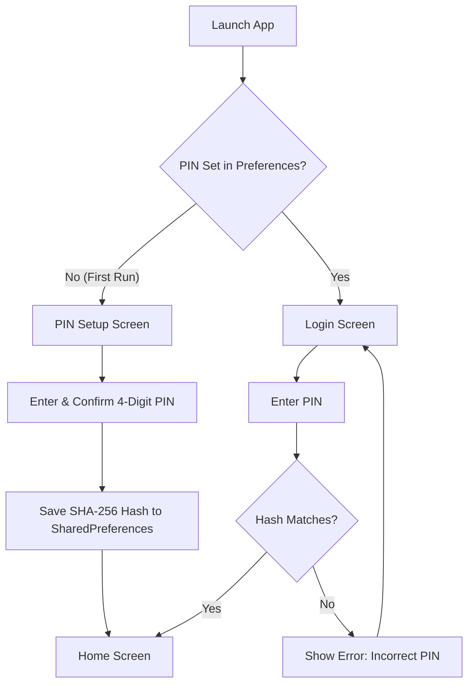
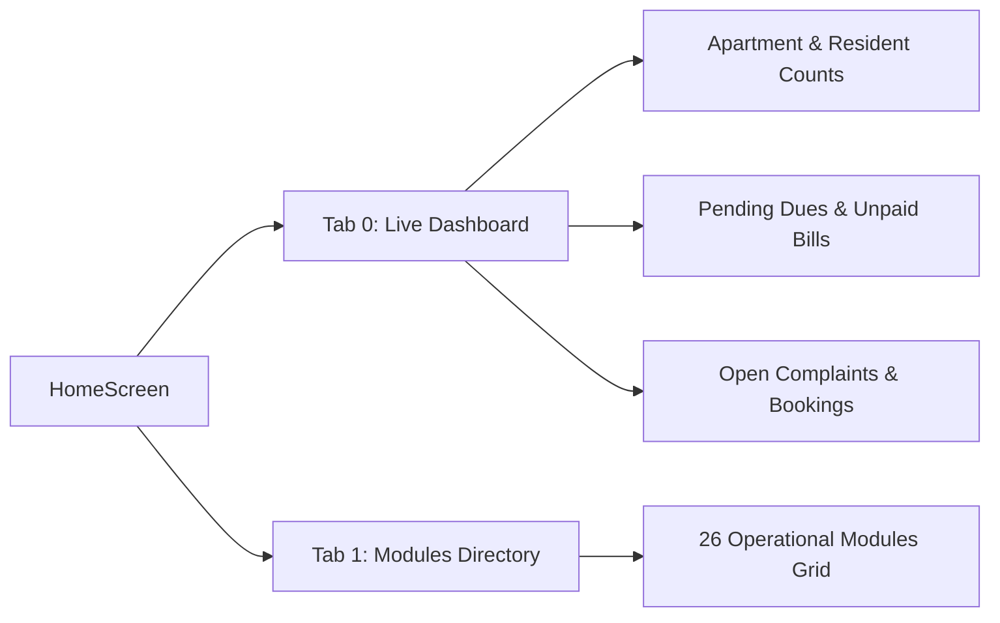
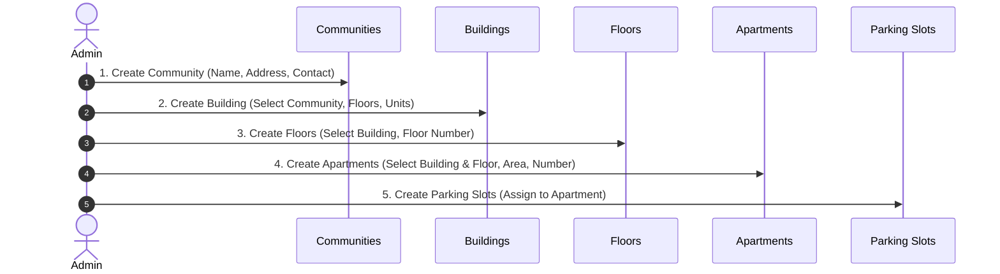
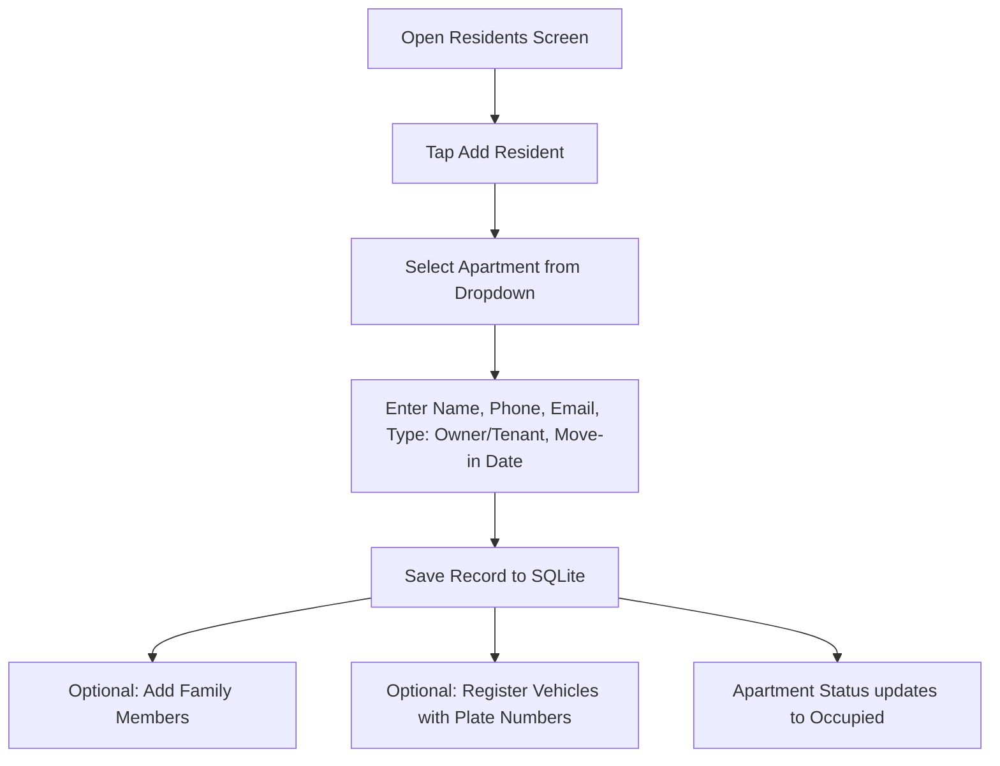
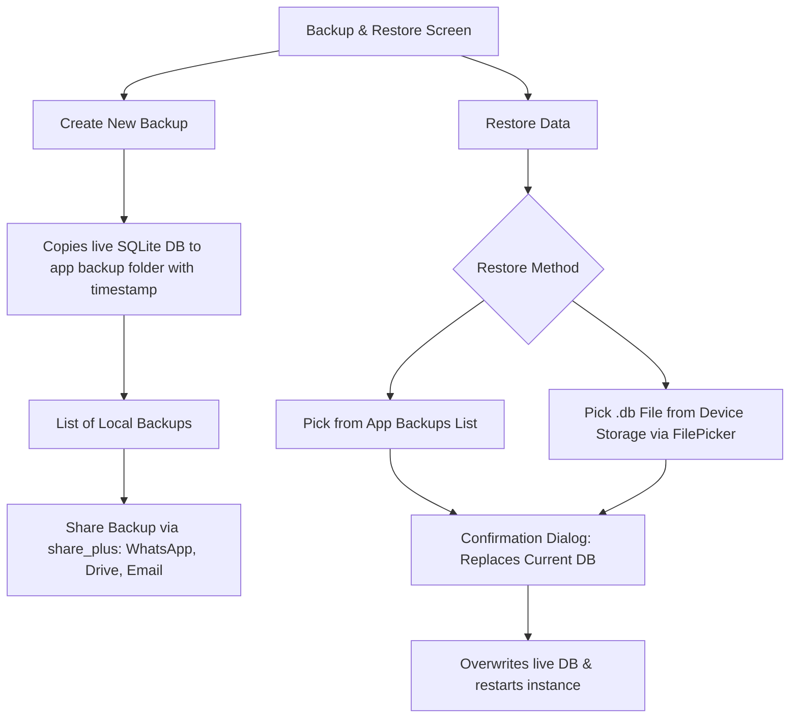
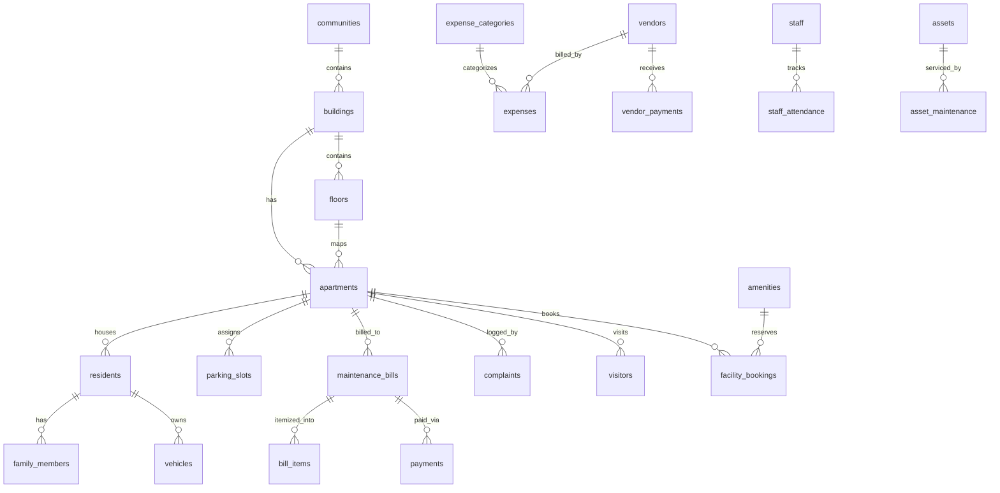

# Apartment Management System — Application Workflow & Architecture

A complete, easy-to-follow guide to the architecture, data structures, and end-to-end user workflows of the **Apartment Management System (Fully Offline Edition)**.

---

## 1. Executive Summary & Core Philosophy

The **Apartment Management System** is a mobile/desktop application built with Flutter designed for residential societies, housing complexes, and apartment communities.

### Key Architectural Pillars:
- **100% Offline by Design**: No cloud backend, no Firebase, and no REST APIs. All data resides in a local SQLite database (`apartment_management.db`) managed via `sqflite`.
- **Zero-Network Privacy**: All attachments, documents, and backups are stored or referenced locally on the physical device.
- **Config-Driven Generic CRUD**: Over 20 modules share a unified, reusable screen (`GenericCrudScreen`) and repository (`BaseRepository`), minimizing boilerplate and ensuring uniform UX.
- **Auditing**: Every create, update, and delete operation automatically records an entry in `audit_logs`.
- **Local Authentication**: App security is enforced via a local 4-to-6 digit PIN, securely hashed using SHA-256 and stored in `SharedPreferences`.

---

## 2. High-Level Architecture

```
┌─────────────────────────────────────────────────────────────┐
│                    Presentation Layer                       │
│  - Startup Gate (PIN Setup / Login)                         │
│  - Home Screen (Bottom Nav: Live Dashboard & Modules Grid)  │
│  - Custom Modules: Maintenance, Reports, Backups, Docs      │
│  - Generic CRUD Screens (Residents, Complaints, Staff, etc) │
└──────────────────────────────┬──────────────────────────────┘
                               │
┌──────────────────────────────▼──────────────────────────────┐
│                    Business & State Layer                   │
│  - StatefulWidgets (Local setState, zero external bloat)     │
│  - FieldConfig Engine (Form definition, field validation)   │
│  - OptionLoaders (Dynamic relational dropdowns)             │
│  - AuthService & BackupService                              │
└──────────────────────────────┬──────────────────────────────┘
                               │
┌──────────────────────────────▼──────────────────────────────┐
│                      Data Access Layer                      │
│  - BaseRepository (Generic insert/update/delete/sum/count)  │
│  - AppDatabase (SQLite Singleton with PRAGMA foreign keys)  │
│  - Automatic Audit Logging (`audit_logs` table)             │
└──────────────────────────────┬──────────────────────────────┘
                               │
┌──────────────────────────────▼──────────────────────────────┐
│                      Device Storage                         │
│  - SQLite File: `<Documents>/apartment_management.db`       │
│  - Backups: `<Documents>/backups/backup_*.db`               │
│  - Preferences: SharedPreferences (Hashed PIN)              │
└─────────────────────────────────────────────────────────────┘
```

---

## 3. End-to-End User & Business Workflows

### Workflow 1: Authentication & App Launch



1. **First Launch**: The `_StartupGate` checks `AuthService.hasPin()`. If `false`, the user is directed to the **PIN Setup Screen** to establish a master code.
2. **Subsequent Launches**: The user enters their PIN on the **Login Screen**. The entered digits are hashed with SHA-256 and compared against the stored hash.
3. **Session**: Once validated, the user is admitted to the `HomeScreen`.

---

### Workflow 2: Home Navigation & Live Dashboard

The `HomeScreen` features a clean 2-tab bottom navigation bar:



- **Dashboard**: Automatically executes fast aggregate SQL queries (`COUNT`, `SUM`) on startup and on pull-to-refresh to present real-time KPIs:
  - Total Apartments & Registered Residents
  - Total Pending Maintenance Amount
  - Unresolved Complaints & Upcoming Facility Bookings
  - Quick shortcuts directly into billing or complaints
- **Modules Grid**: Provides direct access to all 26 operational sub-modules categorized under Property, People, Finance, Community, Staff, and Utilities.

---

### Workflow 3: Initial Setup & Hierarchy (Day 1 Onboarding)

To set up a residential community, the administrator follows this natural relational sequence:



1. **Community**: Create the master entity (e.g., "Green Valley Heights").
2. **Buildings / Blocks**: Add blocks (e.g., "Tower A", "Tower B") linked to the community.
3. **Floors & Units**: Define floors and register apartment units with square footage and status (`vacant` / `occupied`).
4. **Parking Slots**: Add parking slots and map them to units.

---

### Workflow 4: Resident Onboarding & Vehicle Registration

When an owner or tenant moves into an apartment:



1. **Resident Registration**: Administrator selects the apartment from a dynamic dropdown populated by `OptionLoaders.apartments`, enters resident contact details, and marks them as owner or tenant.
2. **Family Members**: Secondary members are registered under the resident's ID.
3. **Vehicles**: Vehicles with registration plates and models are linked to the resident for gate pass and parking verification.

---

### Workflow 5: Maintenance Billing & Payment Lifecycle

The financial heartbeat of the community:

```mermaid
sequenceDiagram
    autonumber
    actor Admin
    participant Gen as GenerateBillScreen
    participant DB as SQLite DB
    participant Details as BillDetailsScreen
    participant Pay as PaymentsScreen
    
    Admin->>Gen: Open Maintenance -> Tap "Generate Bills"
    Admin->>Gen: Select Month, Year, Due Date, Flat Amount
    Admin->>Gen: Select Target Apartments (All or Selected)
    Gen->>DB: Batch insert into `maintenance_bills` (status = 'unpaid')
    
    Note over Admin,Details: Individual Customization
    Admin->>Details: Open Specific Bill
    Admin->>Details: Add Custom Line Item (Water, Penalty, Repair)
    Details->>DB: Insert `bill_items` & Update Bill Total
    
    Note over Admin,Pay: Resident Makes Payment
    Admin->>Details: Tap "Record Payment"
    Admin->>Details: Input Paid Amount, Mode (Cash, UPI, Cheque), Reference
    Details->>DB: Insert `payments` record
    Details->>DB: Update Bill Status: 'paid' (or partial)
    Admin->>Details: Generate & Print/Share PDF Receipt
```

1. **Batch Generation**: Instead of generating bills manually one-by-one, the admin selects a month/year and base amount (e.g., ₹2,500). The app generates bills for all selected units in a single transaction.
2. **Custom Line Items**: The admin can open any bill to attach specific itemized charges (e.g., diesel generator charges, clubhouse fee).
3. **Recording Payments**: When payment is received, the admin logs the transaction with payment method (Cash, UPI, Cheque, Bank Transfer, Card) and transaction reference number. The bill status updates to `paid`.
4. **Offline PDF Invoice & Receipt**: Printable, shareable invoices can be viewed directly on the device.

---

### Workflow 6: Daily Society Operations

#### A. Visitor Management
- Gate security logs incoming visitors with name, phone number, destination apartment, purpose, and entry timestamp.
- When the visitor departs, security marks their exit timestamp.
- Visitor pass numbers/codes can be generated and verified.

#### B. Helpdesk & Complaints
- Residents report maintenance issues (Plumbing, Electrical, Noise, etc.).
- Admin tracks complaints by priority (`low`, `normal`, `high`, `urgent`) and status (`open`, `in_progress`, `resolved`, `closed`).
- Comment history tracks ongoing progress on each ticket.

#### C. Facility & Amenity Booking
- Society amenities (Clubhouse, Swimming Pool, Tennis Court, Party Hall) are registered with capacity limits.
- Booking requests are logged against specific apartments, dates, and time slots to prevent scheduling conflicts.

#### D. Notices & Events
- Broadcast announcements (e.g., water tank cleaning, AGM meetings) are posted with priority flags.
- Festival and community events are scheduled with date and venue details.

#### E. Staff & Vendor Management
- Staff profiles (security guards, sweepers, maintenance crew) with roles and salaries.
- Daily attendance tracking (`present`, `absent`, `half-day`, `on_leave`).
- Vendor contracts and service payments tracking.

#### F. Community Assets
- Physical infrastructure assets (generators, pumps, lifts, CCTV systems) are tracked with purchase dates, values, and maintenance logs.

#### G. Document Vault
- Local copies of society bylaws, floor plans, and contracts are indexed via the device's native file picker (`file_picker`). Files remain securely in local device storage.

---

### Workflow 7: Reports & Financial Analytics

The **Reports Module** aggregates financial metrics using local SQLite queries:

```
┌─────────────────────────────────────────────────────────────┐
│                    Financial Overview                       │
├──────────────────────────────┬──────────────────────────────┤
│  Total Collected: ₹X,XX,XXX  │  Pending Dues:   ₹XX,XXX     │
├──────────────────────────────┼──────────────────────────────┤
│  Total Expenses:  ₹XX,XXX    │  Net Balance:    ₹X,XX,XXX   │
└──────────────────────────────┴──────────────────────────────┘

┌─────────────────────────────────────────────────────────────┐
│             Collection Trends (Last 6 Months)               │
│                                                             │
│   ₹ │             █                                         │
│     │       █     █     █                                   │
│     │ █     █     █     █     █     █                       │
│     └───────────────────────────────────                    │
│       M-5   M-4   M-3   M-2   M-1  Curr                     │
└─────────────────────────────────────────────────────────────┘
```

- **KPI Cards**: Computed live via `BaseRepository.sum(...)`.
- **Bar Chart**: Powered by `fl_chart`, visualizing month-on-month maintenance collections for the last 6 months via SQL `GROUP BY strftime('%Y-%m', payment_date)`.
- **Auditing**: Expense-to-income balance gives administrators an immediate check on community cash flow.

---

### Workflow 8: Data Protection, Backup & Restore

Because there is no remote cloud server, database safety and portability are managed directly by the administrator:



- **Create Backup**: Copies the active database file (`apartment_management.db`) into a dedicated `backups/` directory with a timestamp (e.g., `backup_2026-09-17T11-00-00.db`).
- **Share Backup**: Exports the backup file via `share_plus` to email, Google Drive, SD card, or messaging apps.
- **Restore Backup**: Restores from an existing local backup or any `.db` file selected through `FilePicker`.

---

## 4. SQLite Schema & Relational Structure



### Table Dictionary:
| Category | Tables | Purpose |
|---|---|---|
| **Property** | `communities`, `buildings`, `floors`, `apartments`, `parking_slots` | Physical layout & unit hierarchy |
| **People** | `residents`, `family_members`, `vehicles` | Resident profiles and linked assets |
| **Finance** | `maintenance_categories`, `maintenance_bills`, `bill_items`, `payments`, `expense_categories`, `expenses` | Invoicing, collections, and expenditures |
| **Operations** | `complaints`, `complaint_comments`, `visitors`, `visitor_passes` | Resident grievances and entry control |
| **Amenities** | `amenities`, `facility_bookings`, `notices`, `events` | Shared facilities and community bulletin |
| **Workforce** | `vendors`, `vendor_payments`, `staff`, `staff_attendance` | Third-party vendors and staff attendance/pay |
| **Assets & Docs** | `assets`, `asset_maintenance`, `documents` | Inventory upkeep and local file references |
| **System** | `users`, `roles`, `audit_logs` | PIN credentials, roles, and immutable audit logs |

---

## 5. Project Directory Map

```
lib/
├── app/
│   ├── app.dart                    # MaterialApp & StartupGate routing logic
│   ├── constants/                  # Application colors and constants
│   ├── routes/                     # Named route declarations
│   └── theme/                      # App theme & typography
├── core/
│   ├── database/
│   │   └── app_database.dart       # SQLite database initialization, schema & seeders
│   ├── repository/
│   │   └── base_repository.dart    # Generic CRUD repository with audit hooks
│   ├── services/
│   │   ├── auth_service.dart       # PIN hashing & SharedPreferences management
│   │   └── backup_service.dart     # SQLite database backup & restore handlers
│   ├── utils/
│   │   ├── currency_utils.dart     # Localized currency formatting
│   │   ├── date_utils.dart         # Date formatting & month name resolution
│   │   └── option_loaders.dart     # Relational dropdown loaders for foreign keys
│   └── widgets/
│       ├── app_card.dart           # Metric cards for Dashboard & Reports
│       ├── app_empty_state.dart    # Clean fallback for empty lists
│       ├── field_config.dart       # Schema descriptor for generic form generator
│       └── generic_crud_screen.dart# Unified list + search + add/edit/delete engine
└── features/
    ├── authentication/             # PIN setup and login screens
    ├── dashboard/                  # Live summary KPI cards & overview
    ├── home/                       # Navigation container (Dashboard + Modules grid)
    ├── community/ & buildings/     # Property structure management
    ├── apartments/ & parking/      # Unit management & slot assignments
    ├── residents/                  # Resident profiles, family, and vehicles
    ├── maintenance/                # Batch bill generation & bill details
    ├── payments/ & expenses/       # Payment records and expense tracking
    ├── complaints/                 # Complaint tracking & comment threads
    ├── visitors/                   # Visitor entry/exit logging & passes
    ├── amenities/                  # Facilities and reservation system
    ├── notices/ & events/          # Community notice board and events
    ├── vendors/ & staff/           # Vendor payments and staff attendance
    ├── assets/                     # Community equipment & maintenance
    ├── reports/                    # Visual analytics and trend charts
    ├── documents/                  # Local device file linking
    ├── backup_restore/             # Database export, import, and sharing
    └── settings/                   # PIN reset, storage overview & audit logs
```

---

## 6. Recommended Admin Operating Workflow

1. **Step 1 — Initial Setup (Day 1)**:
   - Configure master PIN on first launch.
   - Navigate to `Modules -> Community` and create the Society profile.
   - Add Buildings (Towers/Wings), Floors, and Apartments.
   - Configure Parking Slots.

2. **Step 2 — Onboard Residents (Day 1 - Day 5)**:
   - Enter Residents and assign each to their respective apartment.
   - Add family members and vehicle numbers.

3. **Step 3 — Monthly Billing Cycle (Start of every month)**:
   - Open `Maintenance Bills` -> Tap `Generate Bills`.
   - Select the target month, set base charge, and generate for all units.
   - Add special line items to specific units if applicable.

4. **Step 4 — Daily Operations**:
   - Log Visitor entries and exits at security.
   - Review and update incoming Complaints.
   - Record Staff Attendance every morning.
   - Check and approve Facility Bookings for upcoming dates.

5. **Step 5 — Financial Reconciliation (End of month)**:
   - Log resident payments as received.
   - Record community expenses (utilities, security, repairs).
   - Review collection efficiency and trends in the `Reports` screen.

6. **Step 6 — Weekly Routine Maintenance**:
   - Go to `Backup & Restore`.
   - Tap `Create Backup`.
   - Share the `.db` snapshot to a secure external storage (Drive or Email).
